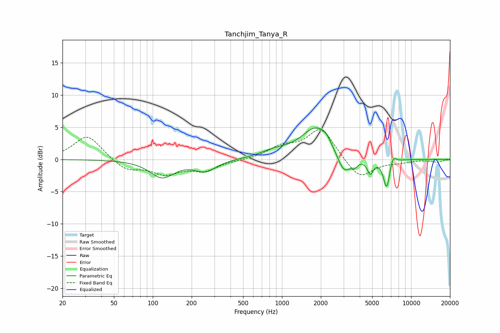

# Tanchjim_Tanya_R
See [usage instructions](https://github.com/jaakkopasanen/AutoEq#usage) for more options and info.

### Parametric EQs
Apply preamp of -5.0 dB when using parametric equalizer.

|   # | Type    |   Fc (Hz) |    Q |   Gain (dB) |
|-----|---------|-----------|------|-------------|
|   1 | Peaking |       118 | 1.52 |        -2.7 |
|   2 | Peaking |       255 | 1.72 |        -1.7 |
|   3 | Peaking |       886 | 1.27 |         1   |
|   4 | Peaking |      1843 | 1.22 |         4.9 |
|   5 | Peaking |      2193 | 3.7  |         0.7 |
|   6 | Peaking |      3016 | 2.61 |        -3.3 |
|   7 | Peaking |      3659 | 6    |        -0.8 |
|   8 | Peaking |      4833 | 6    |        -2.2 |
|   9 | Peaking |      6464 | 5.44 |        -4.6 |
|  10 | Peaking |      7232 | 6    |         1.4 |

### Fixed Band EQs
When using fixed band (also called graphic) equalizer, apply preamp of **-4.7 dB** (if available) and set gains manually with these parameters.

|   # | Type    |   Fc (Hz) |    Q |   Gain (dB) |
|-----|---------|-----------|------|-------------|
|   1 | Peaking |        31 | 1.41 |         3.8 |
|   2 | Peaking |        62 | 1.41 |        -1.7 |
|   3 | Peaking |       125 | 1.41 |        -2.1 |
|   4 | Peaking |       250 | 1.41 |        -1.6 |
|   5 | Peaking |       500 | 1.41 |        -0.1 |
|   6 | Peaking |      1000 | 1.41 |         1.7 |
|   7 | Peaking |      2000 | 1.41 |         4.8 |
|   8 | Peaking |      4000 | 1.41 |        -3.2 |
|   9 | Peaking |      8000 | 1.41 |        -0.4 |
|  10 | Peaking |     16000 | 1.41 |        -0.4 |

### Graphs

