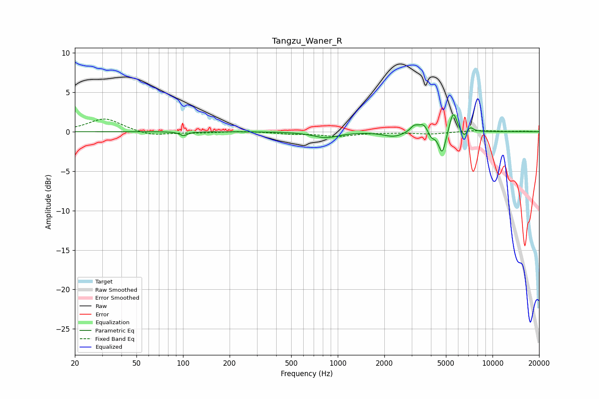

# Tangzu_Waner_R
See [usage instructions](https://github.com/jaakkopasanen/AutoEq#usage) for more options and info.

### Parametric EQs
Apply preamp of -2.2 dB when using parametric equalizer.

|   # | Type    |   Fc (Hz) |    Q |   Gain (dB) |
|-----|---------|-----------|------|-------------|
|   1 | Peaking |       101 | 6    |        -0.5 |
|   2 | Peaking |       835 | 1.78 |        -0.7 |
|   3 | Peaking |      2300 | 2.24 |        -0.6 |
|   4 | Peaking |      3113 | 5.86 |         0.7 |
|   5 | Peaking |      3601 | 4.25 |         1.2 |
|   6 | Peaking |      4000 | 6    |        -0.9 |
|   7 | Peaking |      4730 | 6    |        -3   |
|   8 | Peaking |      5574 | 5.7  |         2.8 |
|   9 | Peaking |      6586 | 6    |        -1   |
|  10 | Peaking |      7126 | 6    |         0.8 |

### Fixed Band EQs
When using fixed band (also called graphic) equalizer, apply preamp of **-1.7 dB** (if available) and set gains manually with these parameters.

|   # | Type    |   Fc (Hz) |    Q |   Gain (dB) |
|-----|---------|-----------|------|-------------|
|   1 | Peaking |        31 | 1.41 |         1.7 |
|   2 | Peaking |        62 | 1.41 |        -0.6 |
|   3 | Peaking |       125 | 1.41 |        -0.1 |
|   4 | Peaking |       250 | 1.41 |         0.1 |
|   5 | Peaking |       500 | 1.41 |        -0.2 |
|   6 | Peaking |      1000 | 1.41 |        -0.5 |
|   7 | Peaking |      2000 | 1.41 |        -0.1 |
|   8 | Peaking |      4000 | 1.41 |        -0.3 |
|   9 | Peaking |      8000 | 1.41 |         0.2 |
|  10 | Peaking |     16000 | 1.41 |         0.1 |

### Graphs

