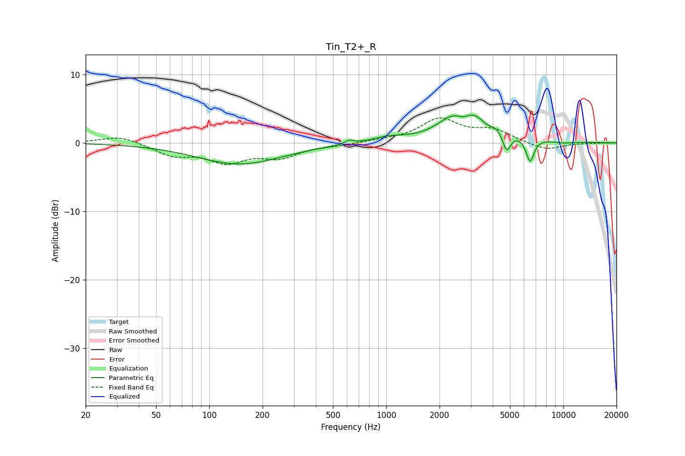

# Tin_T2+_R
See [usage instructions](https://github.com/jaakkopasanen/AutoEq#usage) for more options and info.

### Parametric EQs
Apply preamp of -4.2 dB when using parametric equalizer.

|   # | Type    |   Fc (Hz) |    Q |   Gain (dB) |
|-----|---------|-----------|------|-------------|
|   1 | Peaking |       148 | 0.59 |        -3.1 |
|   2 | Peaking |       619 | 6    |         0.5 |
|   3 | Peaking |      1023 | 1.64 |         0.7 |
|   4 | Peaking |      2250 | 2.23 |         1.1 |
|   5 | Peaking |      2724 | 6    |        -0.5 |
|   6 | Peaking |      3121 | 1.01 |         4.2 |
|   7 | Peaking |      3682 | 4.59 |        -0.8 |
|   8 | Peaking |      4794 | 6    |        -3   |
|   9 | Peaking |      6496 | 6    |        -3.5 |
|  10 | Peaking |     10000 | 2.26 |        -0.2 |

### Fixed Band EQs
When using fixed band (also called graphic) equalizer, apply preamp of **-3.7 dB** (if available) and set gains manually with these parameters.

|   # | Type    |   Fc (Hz) |    Q |   Gain (dB) |
|-----|---------|-----------|------|-------------|
|   1 | Peaking |        31 | 1.41 |         1.1 |
|   2 | Peaking |        62 | 1.41 |        -1.7 |
|   3 | Peaking |       125 | 1.41 |        -2.5 |
|   4 | Peaking |       250 | 1.41 |        -1.9 |
|   5 | Peaking |       500 | 1.41 |        -0.3 |
|   6 | Peaking |      1000 | 1.41 |         0.3 |
|   7 | Peaking |      2000 | 1.41 |         3.4 |
|   8 | Peaking |      4000 | 1.41 |         1.7 |
|   9 | Peaking |      8000 | 1.41 |        -1.1 |
|  10 | Peaking |     16000 | 1.41 |        -0   |

### Graphs

