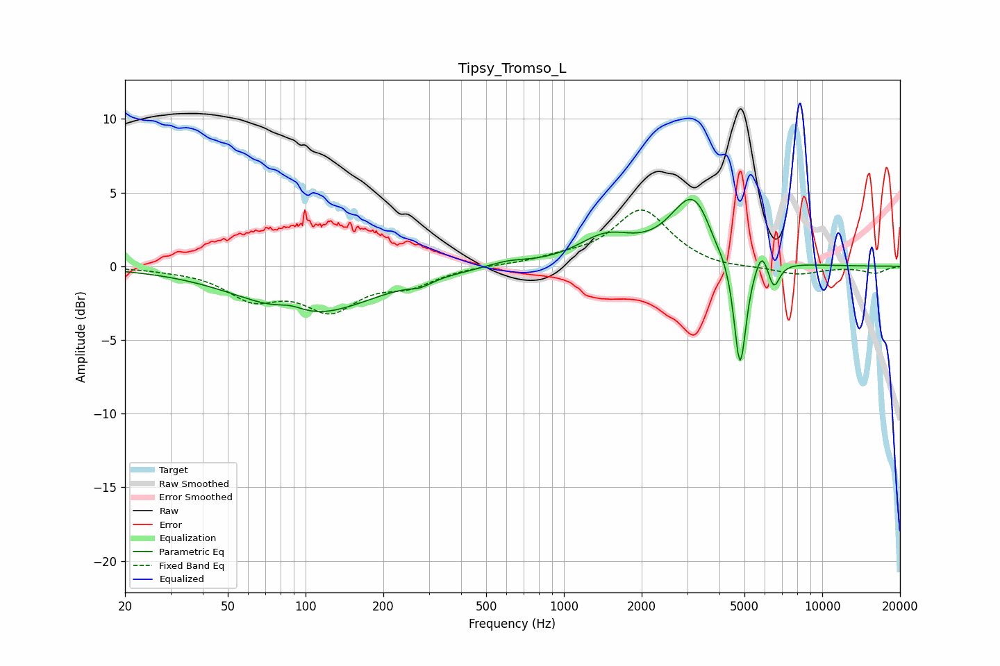

# Tipsy_Tromso_L
See [usage instructions](https://github.com/jaakkopasanen/AutoEq#usage) for more options and info.

### Parametric EQs
Apply preamp of -4.6 dB when using parametric equalizer.

|   # | Type    |   Fc (Hz) |    Q |   Gain (dB) |
|-----|---------|-----------|------|-------------|
|   1 | Peaking |        88 | 2.58 |         0.5 |
|   2 | Peaking |       103 | 0.58 |        -3.3 |
|   3 | Peaking |       278 | 3.36 |        -0.4 |
|   4 | Peaking |       606 | 1.85 |         0.4 |
|   5 | Peaking |      1454 | 1.31 |         1.8 |
|   6 | Peaking |      3189 | 1.6  |         4.8 |
|   7 | Peaking |      3828 | 3.43 |        -0.8 |
|   8 | Peaking |      4806 | 5.77 |        -8   |
|   9 | Peaking |      5839 | 6    |         1.3 |
|  10 | Peaking |      6494 | 6    |        -1.8 |

### Fixed Band EQs
When using fixed band (also called graphic) equalizer, apply preamp of **-3.9 dB** (if available) and set gains manually with these parameters.

|   # | Type    |   Fc (Hz) |    Q |   Gain (dB) |
|-----|---------|-----------|------|-------------|
|   1 | Peaking |        31 | 1.41 |        -0.1 |
|   2 | Peaking |        62 | 1.41 |        -2   |
|   3 | Peaking |       125 | 1.41 |        -2.7 |
|   4 | Peaking |       250 | 1.41 |        -1.1 |
|   5 | Peaking |       500 | 1.41 |         0.1 |
|   6 | Peaking |      1000 | 1.41 |         0.4 |
|   7 | Peaking |      2000 | 1.41 |         3.8 |
|   8 | Peaking |      4000 | 1.41 |        -0.2 |
|   9 | Peaking |      8000 | 1.41 |        -0.6 |
|  10 | Peaking |     16000 | 1.41 |        -0.5 |

### Graphs

