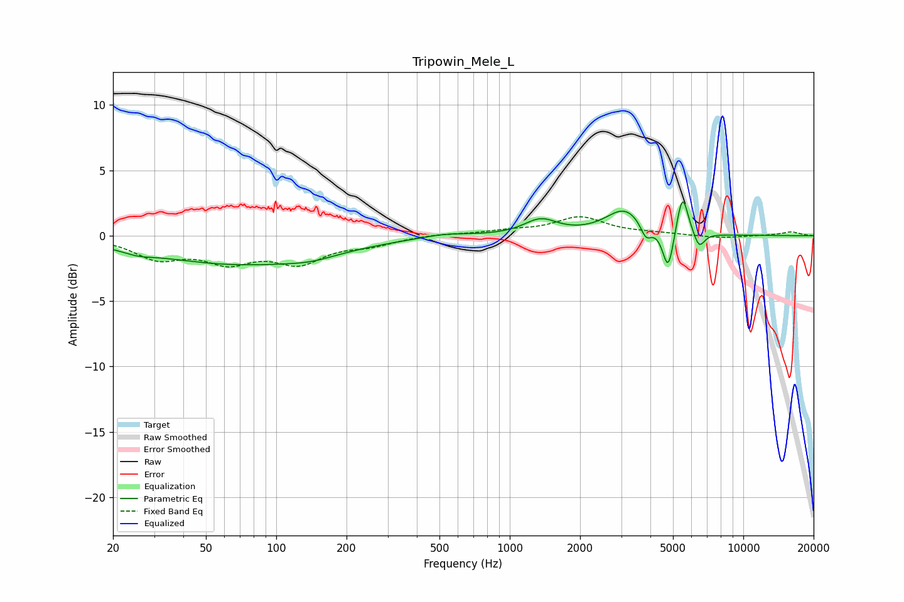

# Tripowin_Mele_L
See [usage instructions](https://github.com/jaakkopasanen/AutoEq#usage) for more options and info.

### Parametric EQs
Apply preamp of -2.7 dB when using parametric equalizer.

|   # | Type    |   Fc (Hz) |    Q |   Gain (dB) |
|-----|---------|-----------|------|-------------|
|   1 | Peaking |        26 | 2.14 |        -0.3 |
|   2 | Peaking |        69 | 0.37 |        -2.1 |
|   3 | Peaking |       141 | 1.3  |        -0.4 |
|   4 | Peaking |       526 | 1.42 |         0.3 |
|   5 | Peaking |      1355 | 2.01 |         1.2 |
|   6 | Peaking |      3112 | 1.75 |         2   |
|   7 | Peaking |      3830 | 6    |        -1.2 |
|   8 | Peaking |      4769 | 6    |        -3.2 |
|   9 | Peaking |      5489 | 5.78 |         3.2 |
|  10 | Peaking |      6472 | 6    |        -1.2 |

### Fixed Band EQs
When using fixed band (also called graphic) equalizer, apply preamp of **-1.6 dB** (if available) and set gains manually with these parameters.

|   # | Type    |   Fc (Hz) |    Q |   Gain (dB) |
|-----|---------|-----------|------|-------------|
|   1 | Peaking |        31 | 1.41 |        -1.6 |
|   2 | Peaking |        62 | 1.41 |        -1.7 |
|   3 | Peaking |       125 | 1.41 |        -1.9 |
|   4 | Peaking |       250 | 1.41 |        -0.6 |
|   5 | Peaking |       500 | 1.41 |         0.1 |
|   6 | Peaking |      1000 | 1.41 |         0.3 |
|   7 | Peaking |      2000 | 1.41 |         1.4 |
|   8 | Peaking |      4000 | 1.41 |         0.1 |
|   9 | Peaking |      8000 | 1.41 |        -0.2 |
|  10 | Peaking |     16000 | 1.41 |         0.3 |

### Graphs

