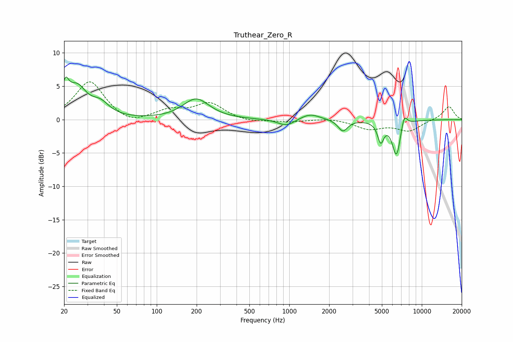

# Truthear_Zero_R
See [usage instructions](https://github.com/jaakkopasanen/AutoEq#usage) for more options and info.

### Parametric EQs
Apply preamp of -6.5 dB when using parametric equalizer.

|   # | Type    |   Fc (Hz) |    Q |   Gain (dB) |
|-----|---------|-----------|------|-------------|
|   1 | Peaking |        20 | 5.55 |         3.3 |
|   2 | Peaking |        25 | 1.95 |         4.4 |
|   3 | Peaking |        38 | 2.13 |         1.8 |
|   4 | Peaking |       198 | 1.44 |         3.1 |
|   5 | Peaking |       951 | 2.24 |        -1.1 |
|   6 | Peaking |      1432 | 1.91 |         0.9 |
|   7 | Peaking |      2538 | 3.99 |        -1.7 |
|   8 | Peaking |      4897 | 6    |        -2.9 |
|   9 | Peaking |      6438 | 4.31 |        -5.4 |
|  10 | Peaking |      7358 | 5.91 |         2.1 |

### Fixed Band EQs
When using fixed band (also called graphic) equalizer, apply preamp of **-5.8 dB** (if available) and set gains manually with these parameters.

|   # | Type    |   Fc (Hz) |    Q |   Gain (dB) |
|-----|---------|-----------|------|-------------|
|   1 | Peaking |        31 | 1.41 |         5.8 |
|   2 | Peaking |        62 | 1.41 |        -1   |
|   3 | Peaking |       125 | 1.41 |         1.3 |
|   4 | Peaking |       250 | 1.41 |         2.4 |
|   5 | Peaking |       500 | 1.41 |        -0.4 |
|   6 | Peaking |      1000 | 1.41 |        -0.3 |
|   7 | Peaking |      2000 | 1.41 |         0.3 |
|   8 | Peaking |      4000 | 1.41 |        -1.3 |
|   9 | Peaking |      8000 | 1.41 |        -1.6 |
|  10 | Peaking |     16000 | 1.41 |         2   |

### Graphs

