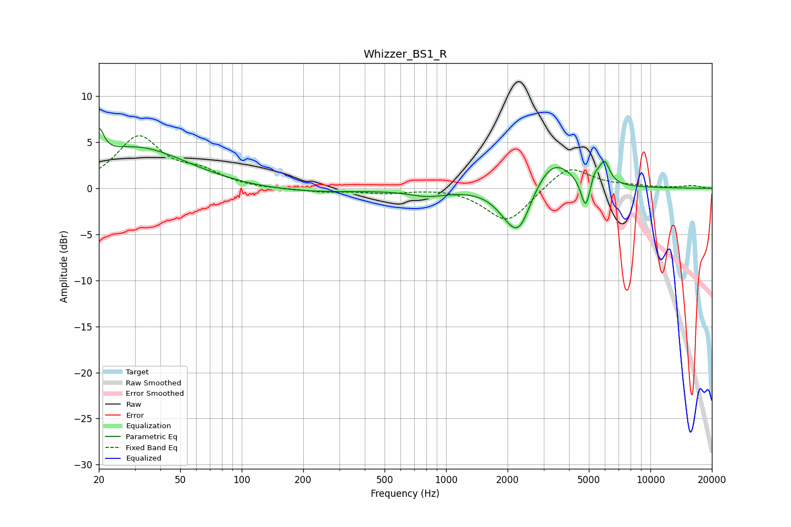

# Whizzer_BS1_R
See [usage instructions](https://github.com/jaakkopasanen/AutoEq#usage) for more options and info.

### Parametric EQs
Apply preamp of -6.6 dB when using parametric equalizer.

|   # | Type    |   Fc (Hz) |    Q |   Gain (dB) |
|-----|---------|-----------|------|-------------|
|   1 | Peaking |        20 | 6    |         3   |
|   2 | Peaking |        30 | 0.57 |         4.4 |
|   3 | Peaking |       195 | 0.5  |        -0.5 |
|   4 | Peaking |       812 | 1.57 |        -0.7 |
|   5 | Peaking |      1985 | 2.14 |        -1.4 |
|   6 | Peaking |      2283 | 2.34 |        -4.6 |
|   7 | Peaking |      3326 | 1.44 |         3.5 |
|   8 | Peaking |      4828 | 6    |        -3.6 |
|   9 | Peaking |      5316 | 5.99 |         1.3 |
|  10 | Peaking |      5967 | 5.47 |         2.4 |

### Fixed Band EQs
When using fixed band (also called graphic) equalizer, apply preamp of **-5.8 dB** (if available) and set gains manually with these parameters.

|   # | Type    |   Fc (Hz) |    Q |   Gain (dB) |
|-----|---------|-----------|------|-------------|
|   1 | Peaking |        31 | 1.41 |         5.4 |
|   2 | Peaking |        62 | 1.41 |         1.5 |
|   3 | Peaking |       125 | 1.41 |        -0.1 |
|   4 | Peaking |       250 | 1.41 |        -0.4 |
|   5 | Peaking |       500 | 1.41 |        -0.5 |
|   6 | Peaking |      1000 | 1.41 |         0.1 |
|   7 | Peaking |      2000 | 1.41 |        -3.8 |
|   8 | Peaking |      4000 | 1.41 |         2.6 |
|   9 | Peaking |      8000 | 1.41 |         0.2 |
|  10 | Peaking |     16000 | 1.41 |         0.3 |

### Graphs

