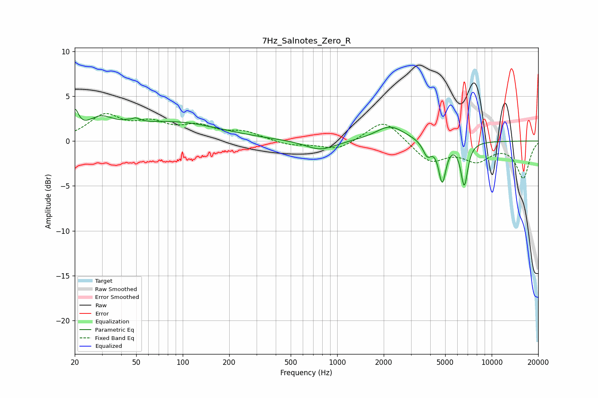

# 7Hz_Salnotes_Zero_R
See [usage instructions](https://github.com/jaakkopasanen/AutoEq#usage) for more options and info.

### Parametric EQs
Apply preamp of -3.6 dB when using parametric equalizer.

|   # | Type    |   Fc (Hz) |    Q |   Gain (dB) |
|-----|---------|-----------|------|-------------|
|   1 | Peaking |        20 | 5.93 |         2.4 |
|   2 | Peaking |        29 | 1.62 |         1.8 |
|   3 | Peaking |        47 | 5.75 |        -1.8 |
|   4 | Peaking |        47 | 4.87 |         2.2 |
|   5 | Peaking |        87 | 0.47 |         2   |
|   6 | Peaking |       778 | 1.46 |        -1.1 |
|   7 | Peaking |      2200 | 1.5  |         1.7 |
|   8 | Peaking |      3825 | 5.04 |        -1.6 |
|   9 | Peaking |      4788 | 6    |        -4.4 |
|  10 | Peaking |      6645 | 6    |        -4.8 |

### Fixed Band EQs
When using fixed band (also called graphic) equalizer, apply preamp of **-3.2 dB** (if available) and set gains manually with these parameters.

|   # | Type    |   Fc (Hz) |    Q |   Gain (dB) |
|-----|---------|-----------|------|-------------|
|   1 | Peaking |        31 | 1.41 |         2.7 |
|   2 | Peaking |        62 | 1.41 |         1.7 |
|   3 | Peaking |       125 | 1.41 |         1.4 |
|   4 | Peaking |       250 | 1.41 |         0.9 |
|   5 | Peaking |       500 | 1.41 |        -0.5 |
|   6 | Peaking |      1000 | 1.41 |        -1   |
|   7 | Peaking |      2000 | 1.41 |         2.5 |
|   8 | Peaking |      4000 | 1.41 |        -2.3 |
|   9 | Peaking |      8000 | 1.41 |        -2   |
|  10 | Peaking |     16000 | 1.41 |        -4   |

### Graphs

