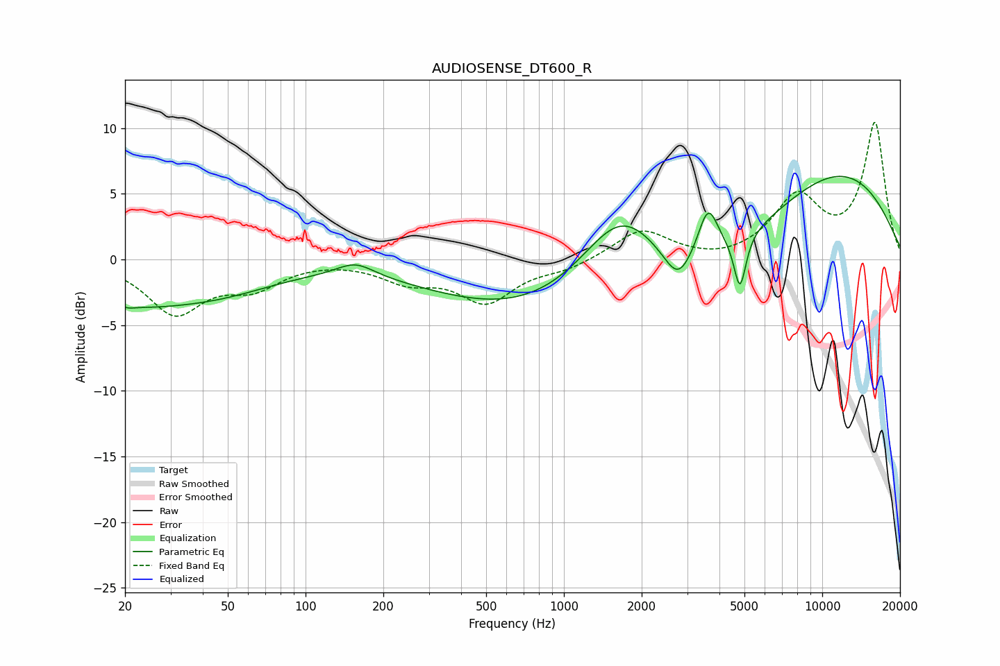

# AUDIOSENSE_DT600_R
See [usage instructions](https://github.com/jaakkopasanen/AutoEq#usage) for more options and info.

### Parametric EQs
Apply preamp of -6.4 dB when using parametric equalizer.

|   # | Type    |   Fc (Hz) |    Q |   Gain (dB) |
|-----|---------|-----------|------|-------------|
|   1 | Peaking |        20 | 0.55 |        -2.9 |
|   2 | Peaking |        21 | 5.71 |        -0.2 |
|   3 | Peaking |        48 | 0.62 |        -1.6 |
|   4 | Peaking |       156 | 1.96 |         1.1 |
|   5 | Peaking |      1661 | 0.84 |         7.3 |
|   6 | Peaking |      1819 | 0.18 |        -5.8 |
|   7 | Peaking |      2766 | 2.61 |        -2.5 |
|   8 | Peaking |      3616 | 3.62 |         3.7 |
|   9 | Peaking |      4803 | 6    |        -4.1 |
|  10 | Peaking |     10000 | 0.35 |         8.3 |

### Fixed Band EQs
When using fixed band (also called graphic) equalizer, apply preamp of **-10.5 dB** (if available) and set gains manually with these parameters.

|   # | Type    |   Fc (Hz) |    Q |   Gain (dB) |
|-----|---------|-----------|------|-------------|
|   1 | Peaking |        31 | 1.41 |        -4   |
|   2 | Peaking |        62 | 1.41 |        -1.8 |
|   3 | Peaking |       125 | 1.41 |         0.1 |
|   4 | Peaking |       250 | 1.41 |        -1.5 |
|   5 | Peaking |       500 | 1.41 |        -3.1 |
|   6 | Peaking |      1000 | 1.41 |        -0.7 |
|   7 | Peaking |      2000 | 1.41 |         2.3 |
|   8 | Peaking |      4000 | 1.41 |        -0.3 |
|   9 | Peaking |      8000 | 1.41 |         4.5 |
|  10 | Peaking |     16000 | 1.41 |        10.3 |

### Graphs

