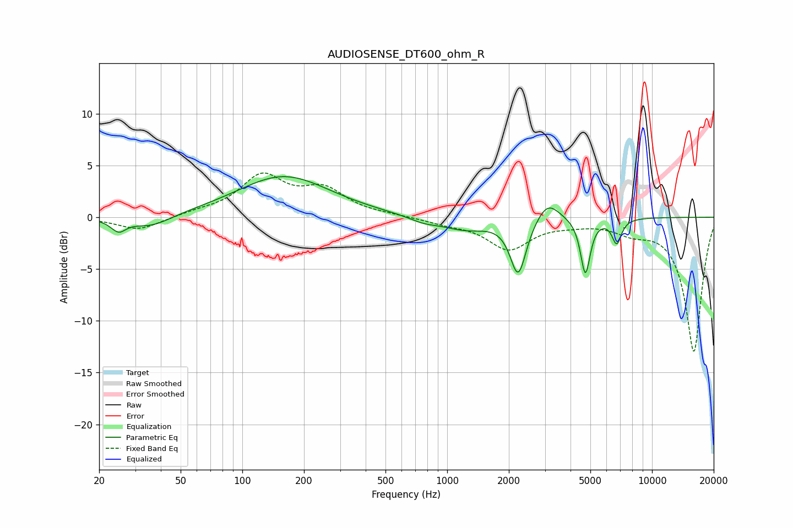

# AUDIOSENSE_DT600_ohm_R
See [usage instructions](https://github.com/jaakkopasanen/AutoEq#usage) for more options and info.

### Parametric EQs
Apply preamp of -4.0 dB when using parametric equalizer.

|   # | Type    |   Fc (Hz) |    Q |   Gain (dB) |
|-----|---------|-----------|------|-------------|
|   1 | Peaking |        25 | 3.57 |        -1.8 |
|   2 | Peaking |        26 | 3.62 |         0.6 |
|   3 | Peaking |        36 | 1.46 |        -1.1 |
|   4 | Peaking |       159 | 0.63 |         4   |
|   5 | Peaking |       767 | 1.89 |        -0.5 |
|   6 | Peaking |      1228 | 1.24 |        -1.1 |
|   7 | Peaking |      2222 | 3.61 |        -5.4 |
|   8 | Peaking |      3091 | 2.5  |         2   |
|   9 | Peaking |      4728 | 5.98 |        -5.4 |
|  10 | Peaking |      6721 | 5.98 |        -2.4 |

### Fixed Band EQs
When using fixed band (also called graphic) equalizer, apply preamp of **-4.4 dB** (if available) and set gains manually with these parameters.

|   # | Type    |   Fc (Hz) |    Q |   Gain (dB) |
|-----|---------|-----------|------|-------------|
|   1 | Peaking |        31 | 1.41 |        -1.3 |
|   2 | Peaking |        62 | 1.41 |         0.4 |
|   3 | Peaking |       125 | 1.41 |         3.8 |
|   4 | Peaking |       250 | 1.41 |         2.4 |
|   5 | Peaking |       500 | 1.41 |         0.1 |
|   6 | Peaking |      1000 | 1.41 |        -0.5 |
|   7 | Peaking |      2000 | 1.41 |        -3   |
|   8 | Peaking |      4000 | 1.41 |        -0.4 |
|   9 | Peaking |      8000 | 1.41 |        -1.1 |
|  10 | Peaking |     16000 | 1.41 |       -13   |

### Graphs

