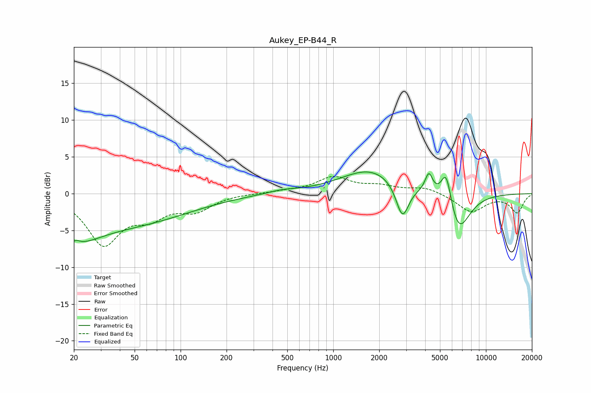

# Aukey_EP-B44_R
See [usage instructions](https://github.com/jaakkopasanen/AutoEq#usage) for more options and info.

### Parametric EQs
Apply preamp of -3.0 dB when using parametric equalizer.

|   # | Type    |   Fc (Hz) |    Q |   Gain (dB) |
|-----|---------|-----------|------|-------------|
|   1 | Peaking |        20 | 0.8  |        -4.6 |
|   2 | Peaking |        21 | 5.12 |        -3.4 |
|   3 | Peaking |        21 | 5.41 |         3.5 |
|   4 | Peaking |        54 | 0.4  |        -3.4 |
|   5 | Peaking |       465 | 1.41 |         0.4 |
|   6 | Peaking |      1766 | 0.72 |         3.3 |
|   7 | Peaking |      2838 | 3.36 |        -4.8 |
|   8 | Peaking |      4230 | 5.62 |         2.7 |
|   9 | Peaking |      5495 | 3.96 |         4.9 |
|  10 | Peaking |      6594 | 1.86 |        -5.6 |

### Fixed Band EQs
When using fixed band (also called graphic) equalizer, apply preamp of **-2.4 dB** (if available) and set gains manually with these parameters.

|   # | Type    |   Fc (Hz) |    Q |   Gain (dB) |
|-----|---------|-----------|------|-------------|
|   1 | Peaking |        31 | 1.41 |        -6.6 |
|   2 | Peaking |        62 | 1.41 |        -2.5 |
|   3 | Peaking |       125 | 1.41 |        -2   |
|   4 | Peaking |       250 | 1.41 |         0   |
|   5 | Peaking |       500 | 1.41 |         0.3 |
|   6 | Peaking |      1000 | 1.41 |         2.1 |
|   7 | Peaking |      2000 | 1.41 |         0.9 |
|   8 | Peaking |      4000 | 1.41 |         0.9 |
|   9 | Peaking |      8000 | 1.41 |        -2.5 |
|  10 | Peaking |     16000 | 1.41 |        -2.5 |

### Graphs

