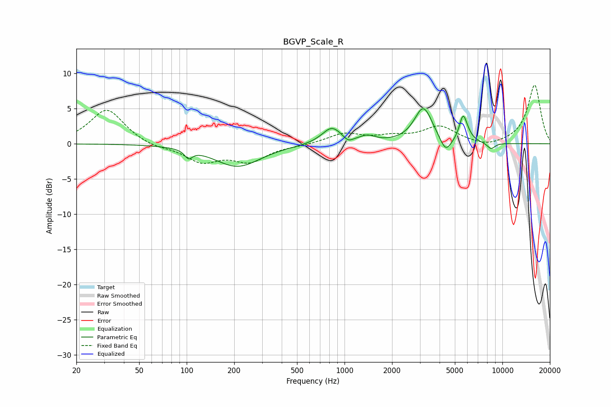

# BGVP_Scale_R
See [usage instructions](https://github.com/jaakkopasanen/AutoEq#usage) for more options and info.

### Parametric EQs
Apply preamp of -5.1 dB when using parametric equalizer.

|   # | Type    |   Fc (Hz) |    Q |   Gain (dB) |
|-----|---------|-----------|------|-------------|
|   1 | Peaking |       103 | 5.96 |        -1.2 |
|   2 | Peaking |       210 | 0.97 |        -3.2 |
|   3 | Peaking |       830 | 2.3  |         2.4 |
|   4 | Peaking |      1053 | 4.9  |        -0.7 |
|   5 | Peaking |      1398 | 2.87 |         0.8 |
|   6 | Peaking |      3158 | 2.47 |         5.1 |
|   7 | Peaking |      4375 | 3.91 |        -2.2 |
|   8 | Peaking |      5629 | 5.9  |         3.2 |
|   9 | Peaking |      5937 | 4.08 |         0.8 |
|  10 | Peaking |      8479 | 5.09 |        -0.9 |

### Fixed Band EQs
When using fixed band (also called graphic) equalizer, apply preamp of **-8.4 dB** (if available) and set gains manually with these parameters.

|   # | Type    |   Fc (Hz) |    Q |   Gain (dB) |
|-----|---------|-----------|------|-------------|
|   1 | Peaking |        31 | 1.41 |         5   |
|   2 | Peaking |        62 | 1.41 |        -0.6 |
|   3 | Peaking |       125 | 1.41 |        -2.4 |
|   4 | Peaking |       250 | 1.41 |        -2.3 |
|   5 | Peaking |       500 | 1.41 |        -0.2 |
|   6 | Peaking |      1000 | 1.41 |         1.4 |
|   7 | Peaking |      2000 | 1.41 |         0.8 |
|   8 | Peaking |      4000 | 1.41 |         2.3 |
|   9 | Peaking |      8000 | 1.41 |        -0.6 |
|  10 | Peaking |     16000 | 1.41 |         8.4 |

### Graphs

