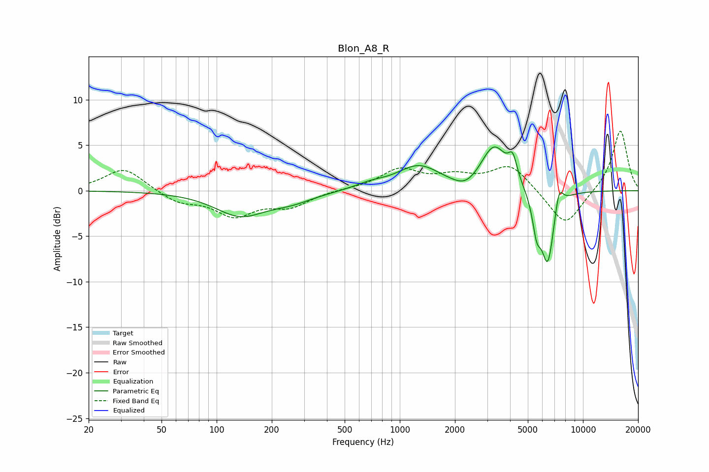

# Blon_A8_R
See [usage instructions](https://github.com/jaakkopasanen/AutoEq#usage) for more options and info.

### Parametric EQs
Apply preamp of -4.9 dB when using parametric equalizer.

|   # | Type    |   Fc (Hz) |    Q |   Gain (dB) |
|-----|---------|-----------|------|-------------|
|   1 | Peaking |       134 | 1.03 |        -2.6 |
|   2 | Peaking |       256 | 1.15 |        -0.9 |
|   3 | Peaking |       686 | 1.69 |         0.5 |
|   4 | Peaking |      1266 | 1.2  |         2.6 |
|   5 | Peaking |      2296 | 2.05 |        -1.2 |
|   6 | Peaking |      3274 | 1.93 |         4.9 |
|   7 | Peaking |      4138 | 6    |         2.3 |
|   8 | Peaking |      5590 | 5.99 |        -3.4 |
|   9 | Peaking |      6423 | 3.75 |        -8.1 |
|  10 | Peaking |      7393 | 5.98 |         2.6 |

### Fixed Band EQs
When using fixed band (also called graphic) equalizer, apply preamp of **-6.6 dB** (if available) and set gains manually with these parameters.

|   # | Type    |   Fc (Hz) |    Q |   Gain (dB) |
|-----|---------|-----------|------|-------------|
|   1 | Peaking |        31 | 1.41 |         2.5 |
|   2 | Peaking |        62 | 1.41 |        -1.2 |
|   3 | Peaking |       125 | 1.41 |        -2.6 |
|   4 | Peaking |       250 | 1.41 |        -1.6 |
|   5 | Peaking |       500 | 1.41 |         0.1 |
|   6 | Peaking |      1000 | 1.41 |         2.2 |
|   7 | Peaking |      2000 | 1.41 |         1.3 |
|   8 | Peaking |      4000 | 1.41 |         2.8 |
|   9 | Peaking |      8000 | 1.41 |        -4.1 |
|  10 | Peaking |     16000 | 1.41 |         6.7 |

### Graphs

