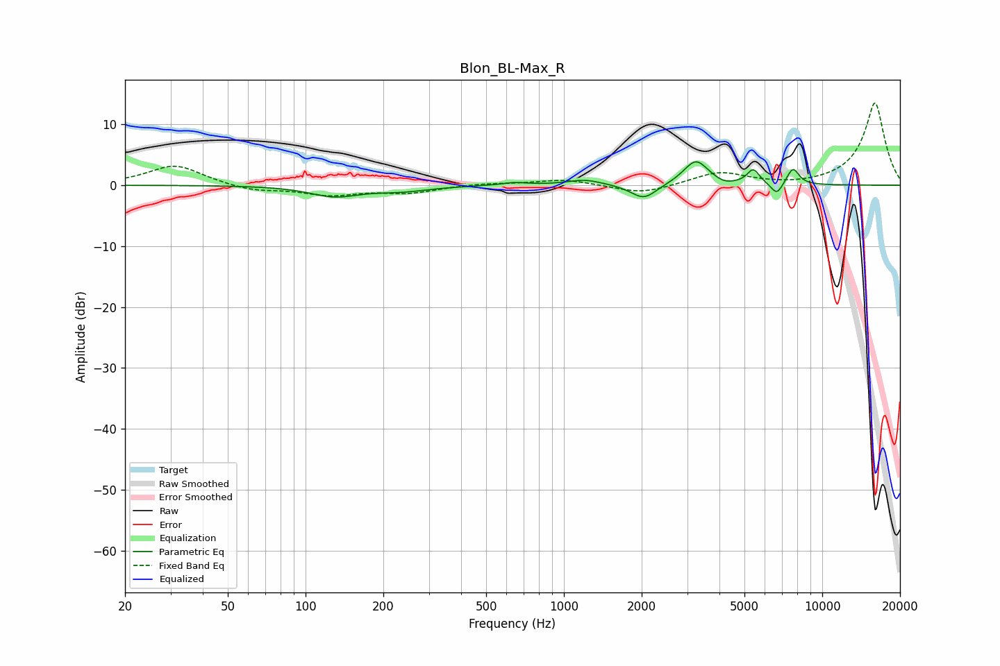

# Blon_BL-Max_R
See [usage instructions](https://github.com/jaakkopasanen/AutoEq#usage) for more options and info.

### Parametric EQs
Apply preamp of -3.9 dB when using parametric equalizer.

|   # | Type    |   Fc (Hz) |    Q |   Gain (dB) |
|-----|---------|-----------|------|-------------|
|   1 | Peaking |       129 | 1.5  |        -1.7 |
|   2 | Peaking |       236 | 1.29 |        -0.8 |
|   3 | Peaking |       644 | 2.83 |         0.5 |
|   4 | Peaking |      1205 | 2.1  |         0.9 |
|   5 | Peaking |      2038 | 2.85 |        -2.5 |
|   6 | Peaking |      3242 | 2.92 |         4.1 |
|   7 | Peaking |      4180 | 4.19 |        -0.5 |
|   8 | Peaking |      5410 | 5.77 |         2.4 |
|   9 | Peaking |      6675 | 6    |        -2   |
|  10 | Peaking |      7699 | 5.61 |         2.8 |

### Fixed Band EQs
When using fixed band (also called graphic) equalizer, apply preamp of **-13.6 dB** (if available) and set gains manually with these parameters.

|   # | Type    |   Fc (Hz) |    Q |   Gain (dB) |
|-----|---------|-----------|------|-------------|
|   1 | Peaking |        31 | 1.41 |         3.3 |
|   2 | Peaking |        62 | 1.41 |        -1   |
|   3 | Peaking |       125 | 1.41 |        -1.5 |
|   4 | Peaking |       250 | 1.41 |        -1.2 |
|   5 | Peaking |       500 | 1.41 |         0.3 |
|   6 | Peaking |      1000 | 1.41 |         1   |
|   7 | Peaking |      2000 | 1.41 |        -1.5 |
|   8 | Peaking |      4000 | 1.41 |         2.1 |
|   9 | Peaking |      8000 | 1.41 |        -0.2 |
|  10 | Peaking |     16000 | 1.41 |        13.6 |

### Graphs

