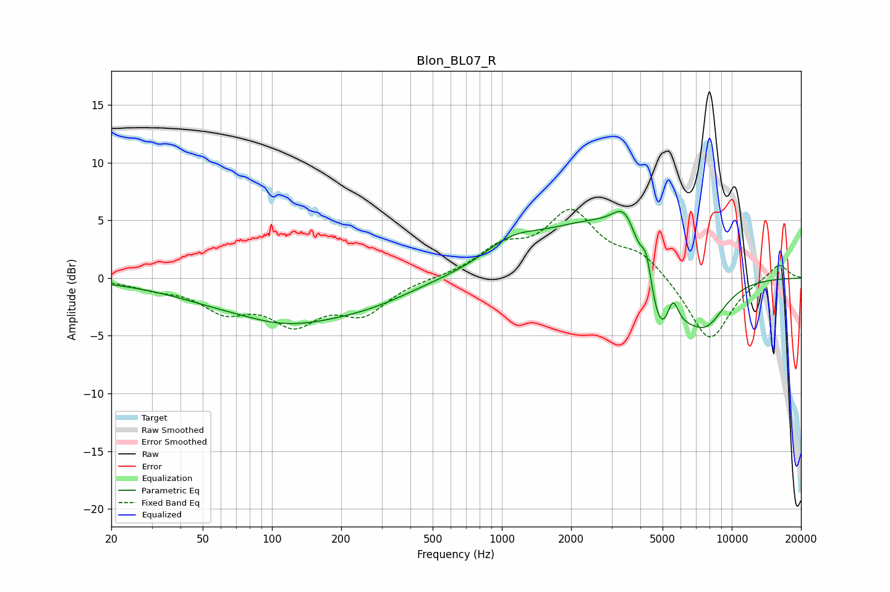

# Blon_BL07_R
See [usage instructions](https://github.com/jaakkopasanen/AutoEq#usage) for more options and info.

### Parametric EQs
Apply preamp of -5.9 dB when using parametric equalizer.

|   # | Type    |   Fc (Hz) |    Q |   Gain (dB) |
|-----|---------|-----------|------|-------------|
|   1 | Peaking |        77 | 0.94 |         0.6 |
|   2 | Peaking |       102 | 0.48 |        -4   |
|   3 | Peaking |       275 | 0.74 |        -1.1 |
|   4 | Peaking |      1099 | 1.13 |         1.8 |
|   5 | Peaking |      2731 | 0.56 |         5.2 |
|   6 | Peaking |      3466 | 2.4  |         3.9 |
|   7 | Peaking |      4260 | 6    |         3   |
|   8 | Peaking |      4972 | 1.55 |        -8.7 |
|   9 | Peaking |      5530 | 5.08 |         3.3 |
|  10 | Peaking |      7724 | 1.48 |        -3.7 |

### Fixed Band EQs
When using fixed band (also called graphic) equalizer, apply preamp of **-6.0 dB** (if available) and set gains manually with these parameters.

|   # | Type    |   Fc (Hz) |    Q |   Gain (dB) |
|-----|---------|-----------|------|-------------|
|   1 | Peaking |        31 | 1.41 |        -0.7 |
|   2 | Peaking |        62 | 1.41 |        -2.5 |
|   3 | Peaking |       125 | 1.41 |        -3.5 |
|   4 | Peaking |       250 | 1.41 |        -2.8 |
|   5 | Peaking |       500 | 1.41 |         0   |
|   6 | Peaking |      1000 | 1.41 |         2.3 |
|   7 | Peaking |      2000 | 1.41 |         5.4 |
|   8 | Peaking |      4000 | 1.41 |         1.9 |
|   9 | Peaking |      8000 | 1.41 |        -5.6 |
|  10 | Peaking |     16000 | 1.41 |         1.3 |

### Graphs

