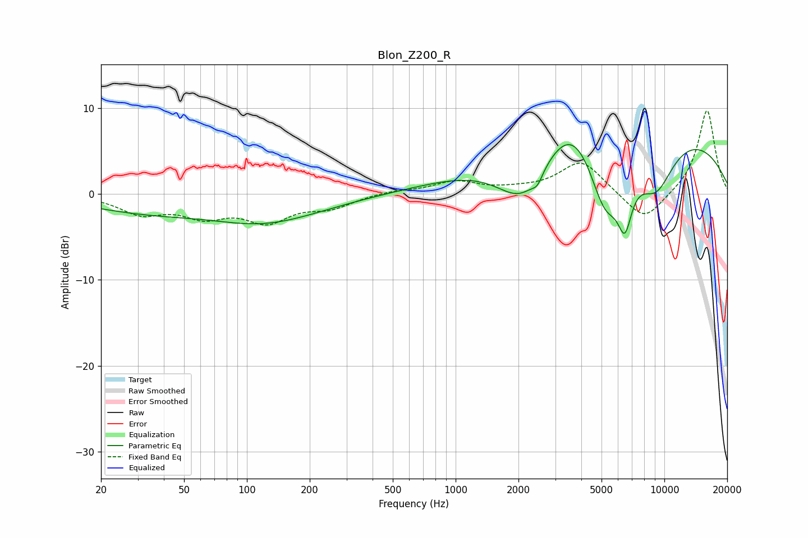

# Blon_Z200_R
See [usage instructions](https://github.com/jaakkopasanen/AutoEq#usage) for more options and info.

### Parametric EQs
Apply preamp of -5.9 dB when using parametric equalizer.

|   # | Type    |   Fc (Hz) |    Q |   Gain (dB) |
|-----|---------|-----------|------|-------------|
|   1 | Peaking |        64 | 0.32 |        -4.1 |
|   2 | Peaking |        74 | 0.5  |         2.7 |
|   3 | Peaking |       110 | 0.56 |        -2.2 |
|   4 | Peaking |      2106 | 1.06 |        -6.9 |
|   5 | Peaking |      2466 | 5.93 |        -1.1 |
|   6 | Peaking |      3683 | 1.03 |         5.5 |
|   7 | Peaking |      5198 | 1.5  |        -9.9 |
|   8 | Peaking |      6471 | 4    |        -5.5 |
|   9 | Peaking |      6542 | 0.18 |         8.5 |
|  10 | Peaking |      9101 | 1.36 |        -6.1 |

### Fixed Band EQs
When using fixed band (also called graphic) equalizer, apply preamp of **-9.8 dB** (if available) and set gains manually with these parameters.

|   # | Type    |   Fc (Hz) |    Q |   Gain (dB) |
|-----|---------|-----------|------|-------------|
|   1 | Peaking |        31 | 1.41 |        -2.1 |
|   2 | Peaking |        62 | 1.41 |        -2.2 |
|   3 | Peaking |       125 | 1.41 |        -2.9 |
|   4 | Peaking |       250 | 1.41 |        -1.4 |
|   5 | Peaking |       500 | 1.41 |         0.4 |
|   6 | Peaking |      1000 | 1.41 |         1.4 |
|   7 | Peaking |      2000 | 1.41 |         0.3 |
|   8 | Peaking |      4000 | 1.41 |         3.9 |
|   9 | Peaking |      8000 | 1.41 |        -3.4 |
|  10 | Peaking |     16000 | 1.41 |         9.9 |

### Graphs

