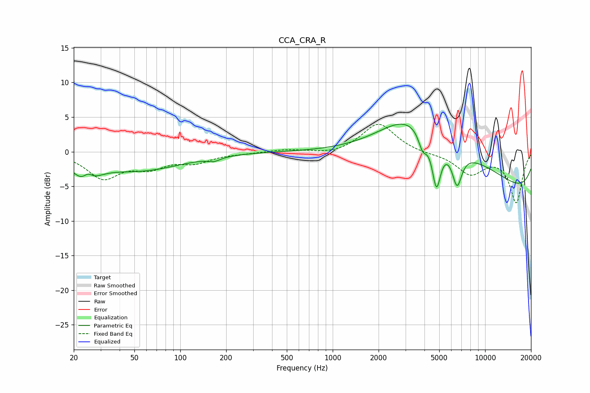

# CCA_CRA_R
See [usage instructions](https://github.com/jaakkopasanen/AutoEq#usage) for more options and info.

### Parametric EQs
Apply preamp of -4.1 dB when using parametric equalizer.

|   # | Type    |   Fc (Hz) |    Q |   Gain (dB) |
|-----|---------|-----------|------|-------------|
|   1 | Peaking |        24 | 1.85 |        -3.3 |
|   2 | Peaking |        25 | 4.38 |         1.5 |
|   3 | Peaking |        54 | 0.5  |        -2.6 |
|   4 | Peaking |       167 | 3.37 |        -0.5 |
|   5 | Peaking |      3137 | 0.7  |         5.1 |
|   6 | Peaking |      3890 | 5.03 |        -2.5 |
|   7 | Peaking |      4793 | 4.84 |        -6.9 |
|   8 | Peaking |      6166 | 0.32 |         6.3 |
|   9 | Peaking |      6544 | 4.22 |        -5   |
|  10 | Peaking |     10000 | 0.18 |        -7.9 |

### Fixed Band EQs
When using fixed band (also called graphic) equalizer, apply preamp of **-4.0 dB** (if available) and set gains manually with these parameters.

|   # | Type    |   Fc (Hz) |    Q |   Gain (dB) |
|-----|---------|-----------|------|-------------|
|   1 | Peaking |        31 | 1.41 |        -3.7 |
|   2 | Peaking |        62 | 1.41 |        -1.9 |
|   3 | Peaking |       125 | 1.41 |        -1.4 |
|   4 | Peaking |       250 | 1.41 |        -0.2 |
|   5 | Peaking |       500 | 1.41 |         0.3 |
|   6 | Peaking |      1000 | 1.41 |        -0.5 |
|   7 | Peaking |      2000 | 1.41 |         4.2 |
|   8 | Peaking |      4000 | 1.41 |        -0.2 |
|   9 | Peaking |      8000 | 1.41 |        -3.1 |
|  10 | Peaking |     16000 | 1.41 |        -7.3 |

### Graphs

