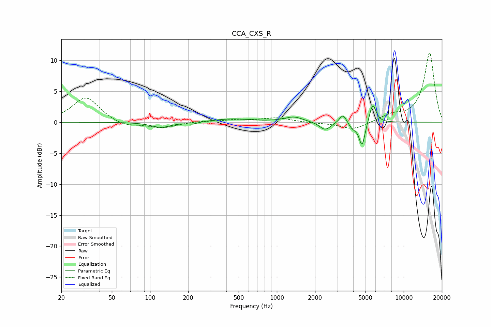

# CCA_CXS_R
See [usage instructions](https://github.com/jaakkopasanen/AutoEq#usage) for more options and info.

### Parametric EQs
Apply preamp of -2.7 dB when using parametric equalizer.

|   # | Type    |   Fc (Hz) |    Q |   Gain (dB) |
|-----|---------|-----------|------|-------------|
|   1 | Peaking |       122 | 1.86 |        -0.9 |
|   2 | Peaking |       216 | 3.49 |        -0.3 |
|   3 | Peaking |       440 | 0.93 |         0.5 |
|   4 | Peaking |      1360 | 1.98 |         0.8 |
|   5 | Peaking |      2403 | 3.23 |        -1.3 |
|   6 | Peaking |      3310 | 5.33 |         1.1 |
|   7 | Peaking |      3419 | 4.02 |         0.5 |
|   8 | Peaking |      3939 | 3.8  |        -1   |
|   9 | Peaking |      4700 | 6    |        -3.8 |
|  10 | Peaking |      5697 | 5.31 |         3.2 |

### Fixed Band EQs
When using fixed band (also called graphic) equalizer, apply preamp of **-11.2 dB** (if available) and set gains manually with these parameters.

|   # | Type    |   Fc (Hz) |    Q |   Gain (dB) |
|-----|---------|-----------|------|-------------|
|   1 | Peaking |        31 | 1.41 |         4.1 |
|   2 | Peaking |        62 | 1.41 |        -0.8 |
|   3 | Peaking |       125 | 1.41 |        -0.9 |
|   4 | Peaking |       250 | 1.41 |         0.2 |
|   5 | Peaking |       500 | 1.41 |         0.4 |
|   6 | Peaking |      1000 | 1.41 |         0.7 |
|   7 | Peaking |      2000 | 1.41 |        -0.1 |
|   8 | Peaking |      4000 | 1.41 |        -1.2 |
|   9 | Peaking |      8000 | 1.41 |         1   |
|  10 | Peaking |     16000 | 1.41 |        11.2 |

### Graphs

