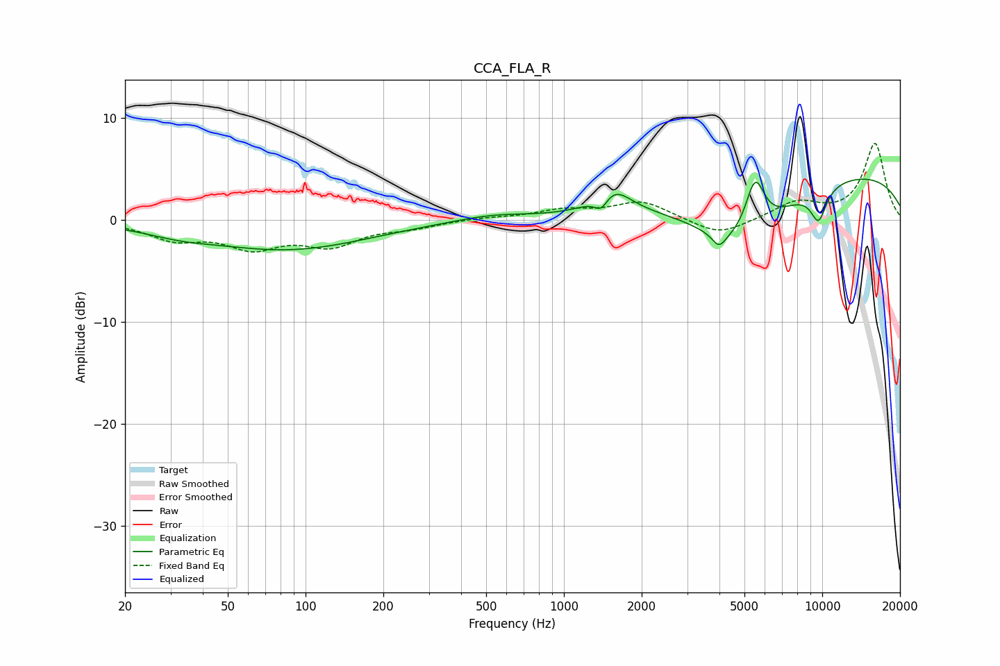

# CCA_FLA_R
See [usage instructions](https://github.com/jaakkopasanen/AutoEq#usage) for more options and info.

### Parametric EQs
Apply preamp of -4.1 dB when using parametric equalizer.

|   # | Type    |   Fc (Hz) |    Q |   Gain (dB) |
|-----|---------|-----------|------|-------------|
|   1 | Peaking |        32 | 1.07 |        -0.7 |
|   2 | Peaking |        86 | 0.45 |        -2.8 |
|   3 | Peaking |       530 | 0.97 |         0.6 |
|   4 | Peaking |      1396 | 5.17 |        -1.5 |
|   5 | Peaking |      1533 | 2.01 |         2.7 |
|   6 | Peaking |      3986 | 5.31 |        -1.3 |
|   7 | Peaking |      4822 | 0.79 |        -6.4 |
|   8 | Peaking |      5493 | 3.61 |         5.4 |
|   9 | Peaking |      9680 | 3.99 |        -3.2 |
|  10 | Peaking |     10000 | 0.21 |         5   |

### Fixed Band EQs
When using fixed band (also called graphic) equalizer, apply preamp of **-7.6 dB** (if available) and set gains manually with these parameters.

|   # | Type    |   Fc (Hz) |    Q |   Gain (dB) |
|-----|---------|-----------|------|-------------|
|   1 | Peaking |        31 | 1.41 |        -1.7 |
|   2 | Peaking |        62 | 1.41 |        -2.4 |
|   3 | Peaking |       125 | 1.41 |        -2.2 |
|   4 | Peaking |       250 | 1.41 |        -0.6 |
|   5 | Peaking |       500 | 1.41 |         0.2 |
|   6 | Peaking |      1000 | 1.41 |         0.9 |
|   7 | Peaking |      2000 | 1.41 |         1.8 |
|   8 | Peaking |      4000 | 1.41 |        -1.6 |
|   9 | Peaking |      8000 | 1.41 |         1.7 |
|  10 | Peaking |     16000 | 1.41 |         7.5 |

### Graphs

