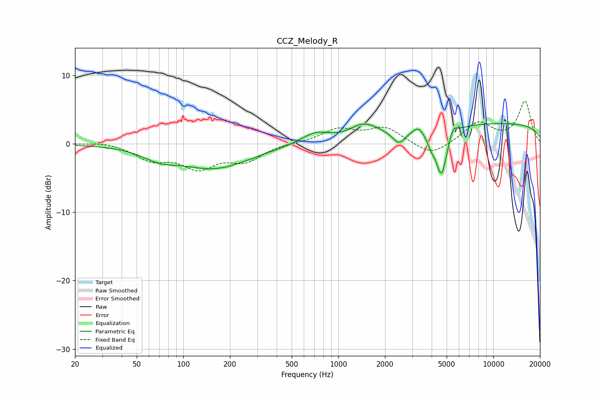

# CCZ_Melody_R
See [usage instructions](https://github.com/jaakkopasanen/AutoEq#usage) for more options and info.

### Parametric EQs
Apply preamp of -3.1 dB when using parametric equalizer.

|   # | Type    |   Fc (Hz) |    Q |   Gain (dB) |
|-----|---------|-----------|------|-------------|
|   1 | Peaking |        70 | 1.35 |        -1.3 |
|   2 | Peaking |       158 | 0.61 |        -3.5 |
|   3 | Peaking |       707 | 1.56 |         1.6 |
|   4 | Peaking |      1464 | 1.63 |         2   |
|   5 | Peaking |      2458 | 3.53 |        -1.9 |
|   6 | Peaking |      3273 | 4.65 |         1   |
|   7 | Peaking |      3994 | 5.29 |        -1.4 |
|   8 | Peaking |      4630 | 3.99 |        -6.9 |
|   9 | Peaking |      5511 | 5.64 |         1.4 |
|  10 | Peaking |     10000 | 0.18 |         3   |

### Fixed Band EQs
When using fixed band (also called graphic) equalizer, apply preamp of **-6.3 dB** (if available) and set gains manually with these parameters.

|   # | Type    |   Fc (Hz) |    Q |   Gain (dB) |
|-----|---------|-----------|------|-------------|
|   1 | Peaking |        31 | 1.41 |         0.4 |
|   2 | Peaking |        62 | 1.41 |        -2.1 |
|   3 | Peaking |       125 | 1.41 |        -3.2 |
|   4 | Peaking |       250 | 1.41 |        -2.3 |
|   5 | Peaking |       500 | 1.41 |         0.1 |
|   6 | Peaking |      1000 | 1.41 |         2   |
|   7 | Peaking |      2000 | 1.41 |         2.3 |
|   8 | Peaking |      4000 | 1.41 |        -1.9 |
|   9 | Peaking |      8000 | 1.41 |         3.1 |
|  10 | Peaking |     16000 | 1.41 |         6.1 |

### Graphs

