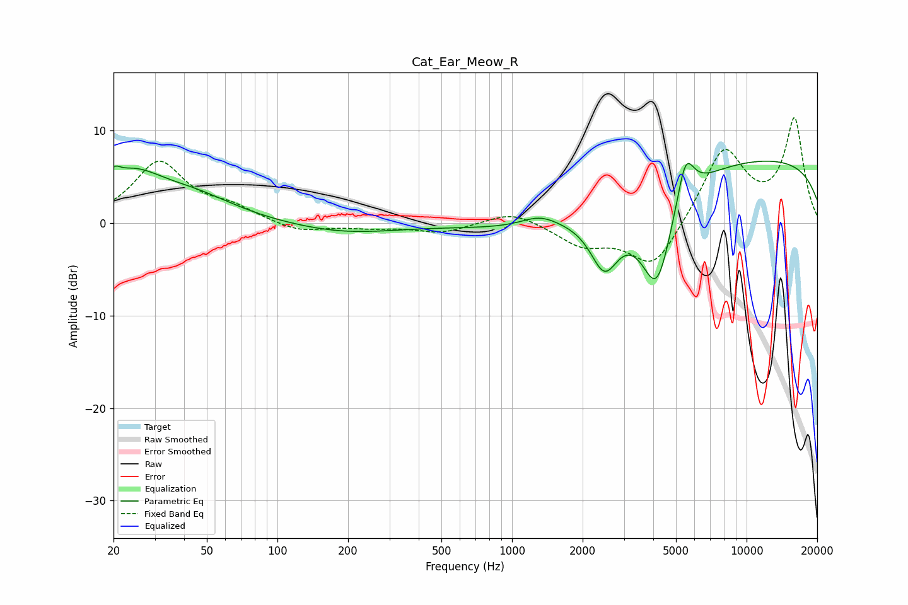

# Cat_Ear_Meow_R
See [usage instructions](https://github.com/jaakkopasanen/AutoEq#usage) for more options and info.

### Parametric EQs
Apply preamp of -6.8 dB when using parametric equalizer.

|   # | Type    |   Fc (Hz) |    Q |   Gain (dB) |
|-----|---------|-----------|------|-------------|
|   1 | Peaking |        20 | 5.95 |         1.2 |
|   2 | Peaking |        24 | 1.05 |         4.6 |
|   3 | Peaking |        44 | 0.77 |         2.3 |
|   4 | Peaking |       192 | 0.62 |        -1.1 |
|   5 | Peaking |      1314 | 1.74 |         1.3 |
|   6 | Peaking |      1580 | 0.49 |        -1.7 |
|   7 | Peaking |      2480 | 2.29 |        -5.9 |
|   8 | Peaking |      4142 | 1.88 |       -11   |
|   9 | Peaking |      5485 | 3.69 |         5.2 |
|  10 | Peaking |     10000 | 0.18 |         7.1 |

### Fixed Band EQs
When using fixed band (also called graphic) equalizer, apply preamp of **-11.5 dB** (if available) and set gains manually with these parameters.

|   # | Type    |   Fc (Hz) |    Q |   Gain (dB) |
|-----|---------|-----------|------|-------------|
|   1 | Peaking |        31 | 1.41 |         6.5 |
|   2 | Peaking |        62 | 1.41 |         1.4 |
|   3 | Peaking |       125 | 1.41 |        -1   |
|   4 | Peaking |       250 | 1.41 |        -0.4 |
|   5 | Peaking |       500 | 1.41 |        -1   |
|   6 | Peaking |      1000 | 1.41 |         1.4 |
|   7 | Peaking |      2000 | 1.41 |        -2.3 |
|   8 | Peaking |      4000 | 1.41 |        -5.1 |
|   9 | Peaking |      8000 | 1.41 |         8   |
|  10 | Peaking |     16000 | 1.41 |        11.1 |

### Graphs

