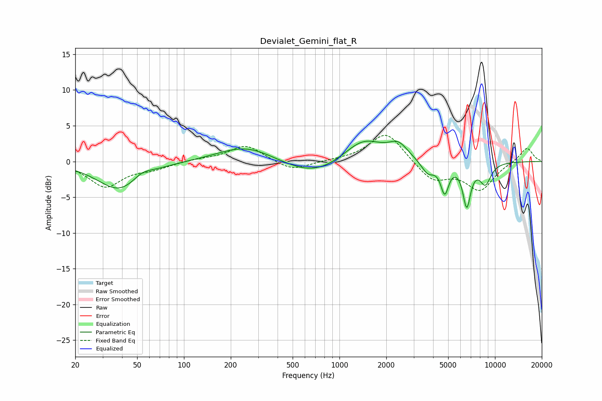

# Devialet_Gemini_flat_R
See [usage instructions](https://github.com/jaakkopasanen/AutoEq#usage) for more options and info.

### Parametric EQs
Apply preamp of -2.9 dB when using parametric equalizer.

|   # | Type    |   Fc (Hz) |    Q |   Gain (dB) |
|-----|---------|-----------|------|-------------|
|   1 | Peaking |        39 | 1.01 |        -4   |
|   2 | Peaking |        54 | 2.35 |         0.9 |
|   3 | Peaking |       252 | 0.78 |         2.3 |
|   4 | Peaking |       688 | 0.72 |        -2.3 |
|   5 | Peaking |      1421 | 1.1  |         3.4 |
|   6 | Peaking |      2391 | 2.31 |         1.9 |
|   7 | Peaking |      3699 | 3.23 |        -1.8 |
|   8 | Peaking |      4751 | 5.39 |        -4   |
|   9 | Peaking |      6583 | 5.37 |        -5.8 |
|  10 | Peaking |      8675 | 3.5  |        -2.9 |

### Fixed Band EQs
When using fixed band (also called graphic) equalizer, apply preamp of **-3.7 dB** (if available) and set gains manually with these parameters.

|   # | Type    |   Fc (Hz) |    Q |   Gain (dB) |
|-----|---------|-----------|------|-------------|
|   1 | Peaking |        31 | 1.41 |        -3.5 |
|   2 | Peaking |        62 | 1.41 |        -0.9 |
|   3 | Peaking |       125 | 1.41 |         0.3 |
|   4 | Peaking |       250 | 1.41 |         2.3 |
|   5 | Peaking |       500 | 1.41 |        -1.4 |
|   6 | Peaking |      1000 | 1.41 |         0.1 |
|   7 | Peaking |      2000 | 1.41 |         4.2 |
|   8 | Peaking |      4000 | 1.41 |        -2.7 |
|   9 | Peaking |      8000 | 1.41 |        -3.9 |
|  10 | Peaking |     16000 | 1.41 |         2   |

### Graphs

