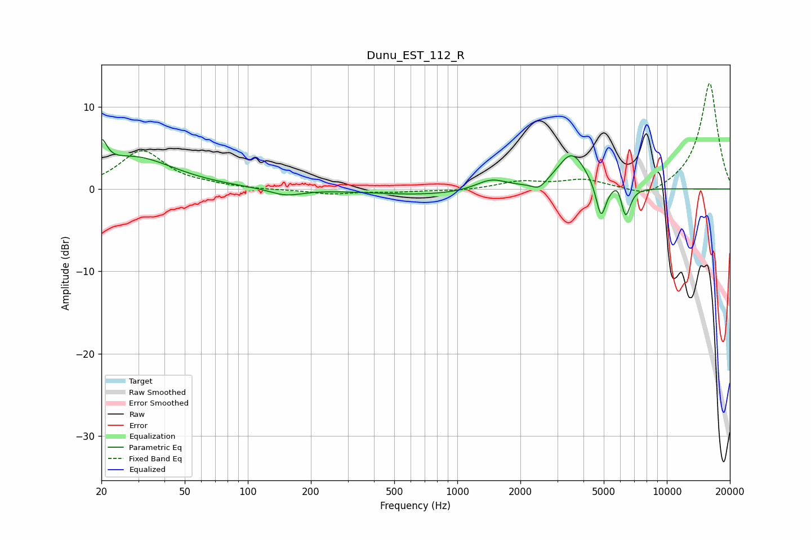

# Dunu_EST_112_R
See [usage instructions](https://github.com/jaakkopasanen/AutoEq#usage) for more options and info.

### Parametric EQs
Apply preamp of -6.1 dB when using parametric equalizer.

|   # | Type    |   Fc (Hz) |    Q |   Gain (dB) |
|-----|---------|-----------|------|-------------|
|   1 | Peaking |        20 | 5.61 |         3.1 |
|   2 | Peaking |        29 | 0.74 |         3.8 |
|   3 | Peaking |       151 | 1.78 |        -0.9 |
|   4 | Peaking |       722 | 0.53 |        -0.7 |
|   5 | Peaking |      1450 | 1.89 |         1.3 |
|   6 | Peaking |      2455 | 4.15 |        -1   |
|   7 | Peaking |      3521 | 2.08 |         4.4 |
|   8 | Peaking |      4852 | 6    |        -4.3 |
|   9 | Peaking |      5852 | 5.98 |         1.3 |
|  10 | Peaking |      6348 | 6    |        -3.9 |

### Fixed Band EQs
When using fixed band (also called graphic) equalizer, apply preamp of **-12.9 dB** (if available) and set gains manually with these parameters.

|   # | Type    |   Fc (Hz) |    Q |   Gain (dB) |
|-----|---------|-----------|------|-------------|
|   1 | Peaking |        31 | 1.41 |         4.6 |
|   2 | Peaking |        62 | 1.41 |         0.3 |
|   3 | Peaking |       125 | 1.41 |        -0.1 |
|   4 | Peaking |       250 | 1.41 |        -0.6 |
|   5 | Peaking |       500 | 1.41 |        -0.3 |
|   6 | Peaking |      1000 | 1.41 |        -0.2 |
|   7 | Peaking |      2000 | 1.41 |         0.9 |
|   8 | Peaking |      4000 | 1.41 |         1.1 |
|   9 | Peaking |      8000 | 1.41 |        -1.3 |
|  10 | Peaking |     16000 | 1.41 |        13   |

### Graphs

