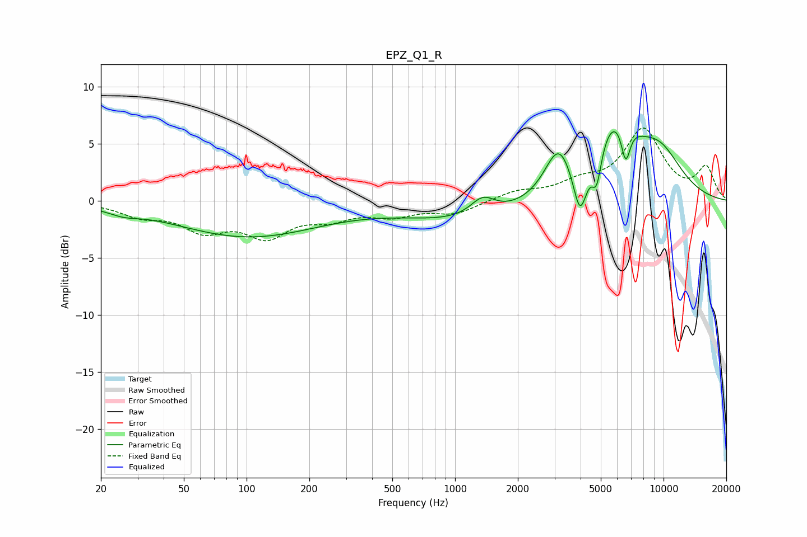

# EPZ_Q1_R
See [usage instructions](https://github.com/jaakkopasanen/AutoEq#usage) for more options and info.

### Parametric EQs
Apply preamp of -6.1 dB when using parametric equalizer.

|   # | Type    |   Fc (Hz) |    Q |   Gain (dB) |
|-----|---------|-----------|------|-------------|
|   1 | Peaking |        26 | 1.89 |        -0.5 |
|   2 | Peaking |       101 | 0.41 |        -3.1 |
|   3 | Peaking |      1169 | 0.47 |        -1.7 |
|   4 | Peaking |      1358 | 2.36 |         1.6 |
|   5 | Peaking |      3126 | 2.18 |         4   |
|   6 | Peaking |      3979 | 4.15 |        -4.6 |
|   7 | Peaking |      4775 | 6    |        -3.1 |
|   8 | Peaking |      5856 | 1.22 |         6.4 |
|   9 | Peaking |      6583 | 6    |        -3.4 |
|  10 | Peaking |      9596 | 1.09 |         3.5 |

### Fixed Band EQs
When using fixed band (also called graphic) equalizer, apply preamp of **-6.5 dB** (if available) and set gains manually with these parameters.

|   # | Type    |   Fc (Hz) |    Q |   Gain (dB) |
|-----|---------|-----------|------|-------------|
|   1 | Peaking |        31 | 1.41 |        -1.1 |
|   2 | Peaking |        62 | 1.41 |        -2.3 |
|   3 | Peaking |       125 | 1.41 |        -2.8 |
|   4 | Peaking |       250 | 1.41 |        -1.2 |
|   5 | Peaking |       500 | 1.41 |        -1.1 |
|   6 | Peaking |      1000 | 1.41 |        -1.1 |
|   7 | Peaking |      2000 | 1.41 |         0.8 |
|   8 | Peaking |      4000 | 1.41 |         1.3 |
|   9 | Peaking |      8000 | 1.41 |         6   |
|  10 | Peaking |     16000 | 1.41 |         2.8 |

### Graphs

