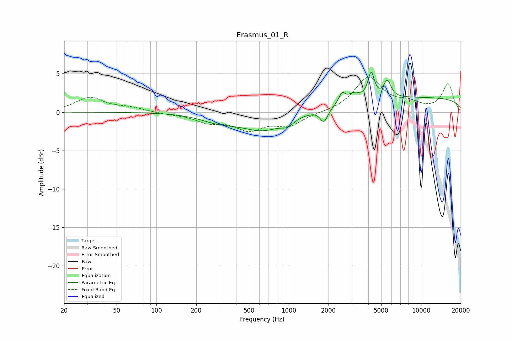

# Erasmus_01_R
See [usage instructions](https://github.com/jaakkopasanen/AutoEq#usage) for more options and info.

### Parametric EQs
Apply preamp of -5.3 dB when using parametric equalizer.

|   # | Type    |   Fc (Hz) |    Q |   Gain (dB) |
|-----|---------|-----------|------|-------------|
|   1 | Peaking |       285 | 1.1  |        -0.8 |
|   2 | Peaking |       494 | 1.87 |         0.2 |
|   3 | Peaking |       619 | 0.81 |        -2.4 |
|   4 | Peaking |       980 | 3.26 |        -0.7 |
|   5 | Peaking |      1848 | 4.87 |        -1.8 |
|   6 | Peaking |      2529 | 5.85 |         1.3 |
|   7 | Peaking |      3105 | 3.16 |         1   |
|   8 | Peaking |      4199 | 5.91 |         3.3 |
|   9 | Peaking |      5576 | 5.22 |         2.2 |
|  10 | Peaking |      9654 | 0.18 |         1.9 |

### Fixed Band EQs
When using fixed band (also called graphic) equalizer, apply preamp of **-4.6 dB** (if available) and set gains manually with these parameters.

|   # | Type    |   Fc (Hz) |    Q |   Gain (dB) |
|-----|---------|-----------|------|-------------|
|   1 | Peaking |        31 | 1.41 |         1.9 |
|   2 | Peaking |        62 | 1.41 |         0.5 |
|   3 | Peaking |       125 | 1.41 |        -0.2 |
|   4 | Peaking |       250 | 1.41 |        -1.2 |
|   5 | Peaking |       500 | 1.41 |        -2.1 |
|   6 | Peaking |      1000 | 1.41 |        -1.6 |
|   7 | Peaking |      2000 | 1.41 |        -0   |
|   8 | Peaking |      4000 | 1.41 |         4.4 |
|   9 | Peaking |      8000 | 1.41 |         1   |
|  10 | Peaking |     16000 | 1.41 |         3.6 |

### Graphs

