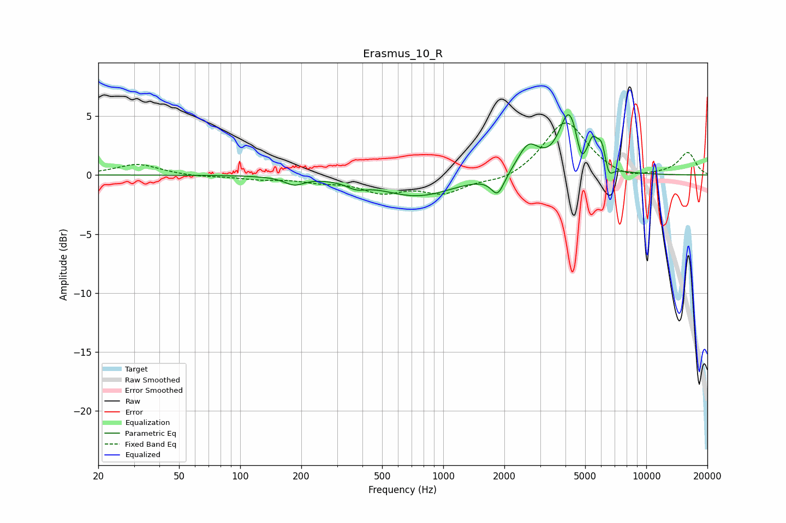

# Erasmus_10_R
See [usage instructions](https://github.com/jaakkopasanen/AutoEq#usage) for more options and info.

### Parametric EQs
Apply preamp of -5.2 dB when using parametric equalizer.

|   # | Type    |   Fc (Hz) |    Q |   Gain (dB) |
|-----|---------|-----------|------|-------------|
|   1 | Peaking |       184 | 2.99 |        -0.7 |
|   2 | Peaking |       373 | 2.94 |        -0.5 |
|   3 | Peaking |       746 | 0.8  |        -1.8 |
|   4 | Peaking |      1856 | 4.34 |        -1.7 |
|   5 | Peaking |      2626 | 2.64 |         2.4 |
|   6 | Peaking |      4177 | 2.85 |         5.2 |
|   7 | Peaking |      4781 | 5.98 |        -1.9 |
|   8 | Peaking |      5442 | 5.99 |         1.7 |
|   9 | Peaking |      6063 | 5.4  |         2.4 |
|  10 | Peaking |      6490 | 6    |        -1.7 |

### Fixed Band EQs
When using fixed band (also called graphic) equalizer, apply preamp of **-4.5 dB** (if available) and set gains manually with these parameters.

|   # | Type    |   Fc (Hz) |    Q |   Gain (dB) |
|-----|---------|-----------|------|-------------|
|   1 | Peaking |        31 | 1.41 |         0.9 |
|   2 | Peaking |        62 | 1.41 |        -0.1 |
|   3 | Peaking |       125 | 1.41 |        -0.3 |
|   4 | Peaking |       250 | 1.41 |        -0.4 |
|   5 | Peaking |       500 | 1.41 |        -1.3 |
|   6 | Peaking |      1000 | 1.41 |        -1.4 |
|   7 | Peaking |      2000 | 1.41 |        -0.6 |
|   8 | Peaking |      4000 | 1.41 |         4.6 |
|   9 | Peaking |      8000 | 1.41 |        -0.5 |
|  10 | Peaking |     16000 | 1.41 |         1.9 |

### Graphs

