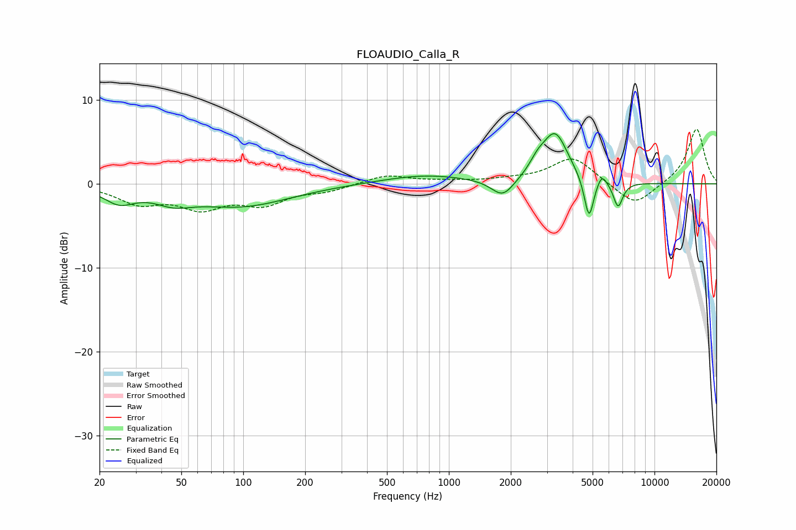

# FLOAUDIO_Calla_R
See [usage instructions](https://github.com/jaakkopasanen/AutoEq#usage) for more options and info.

### Parametric EQs
Apply preamp of -6.1 dB when using parametric equalizer.

|   # | Type    |   Fc (Hz) |    Q |   Gain (dB) |
|-----|---------|-----------|------|-------------|
|   1 | Peaking |        25 | 1.91 |        -1.8 |
|   2 | Peaking |        46 | 1.59 |        -1.3 |
|   3 | Peaking |        97 | 0.59 |        -2.6 |
|   4 | Peaking |       763 | 0.68 |         1.1 |
|   5 | Peaking |      1829 | 2.55 |        -2.2 |
|   6 | Peaking |      2695 | 3.67 |         1.2 |
|   7 | Peaking |      3286 | 2.23 |         5.9 |
|   8 | Peaking |      4803 | 5.99 |        -5.1 |
|   9 | Peaking |      5550 | 6    |         1.3 |
|  10 | Peaking |      6650 | 5.92 |        -3   |

### Fixed Band EQs
When using fixed band (also called graphic) equalizer, apply preamp of **-6.6 dB** (if available) and set gains manually with these parameters.

|   # | Type    |   Fc (Hz) |    Q |   Gain (dB) |
|-----|---------|-----------|------|-------------|
|   1 | Peaking |        31 | 1.41 |        -2.1 |
|   2 | Peaking |        62 | 1.41 |        -2.6 |
|   3 | Peaking |       125 | 1.41 |        -2.2 |
|   4 | Peaking |       250 | 1.41 |        -0.7 |
|   5 | Peaking |       500 | 1.41 |         1.1 |
|   6 | Peaking |      1000 | 1.41 |         0.3 |
|   7 | Peaking |      2000 | 1.41 |         0.4 |
|   8 | Peaking |      4000 | 1.41 |         3.2 |
|   9 | Peaking |      8000 | 1.41 |        -2.8 |
|  10 | Peaking |     16000 | 1.41 |         6.6 |

### Graphs

