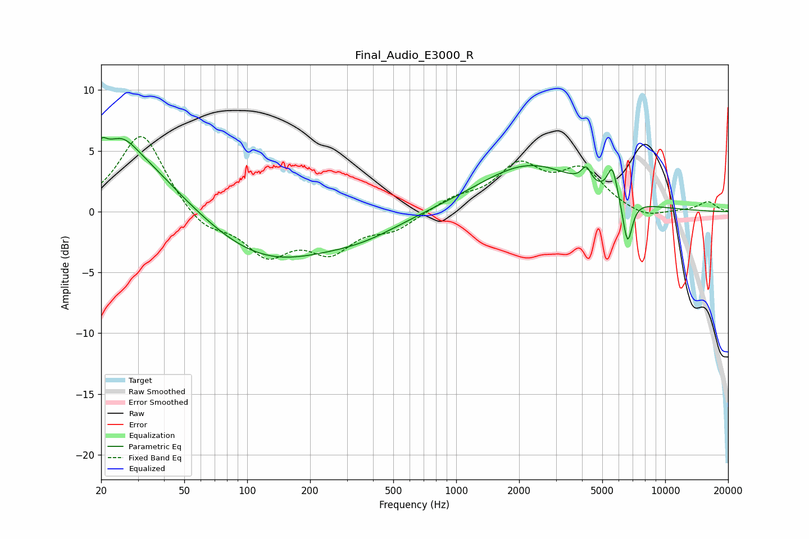

# Final_Audio_E3000_R
See [usage instructions](https://github.com/jaakkopasanen/AutoEq#usage) for more options and info.

### Parametric EQs
Apply preamp of -6.2 dB when using parametric equalizer.

|   # | Type    |   Fc (Hz) |    Q |   Gain (dB) |
|-----|---------|-----------|------|-------------|
|   1 | Peaking |        20 | 5.94 |         3.2 |
|   2 | Peaking |        20 | 5.89 |        -2.3 |
|   3 | Peaking |        25 | 0.57 |         5.4 |
|   4 | Peaking |        25 | 2.19 |         1.2 |
|   5 | Peaking |       123 | 0.46 |        -4   |
|   6 | Peaking |       363 | 0.74 |        -1.2 |
|   7 | Peaking |      2243 | 0.58 |         3.9 |
|   8 | Peaking |      4190 | 6    |         1.3 |
|   9 | Peaking |      5582 | 5.96 |         2.5 |
|  10 | Peaking |      6606 | 6    |        -3.7 |

### Fixed Band EQs
When using fixed band (also called graphic) equalizer, apply preamp of **-6.3 dB** (if available) and set gains manually with these parameters.

|   # | Type    |   Fc (Hz) |    Q |   Gain (dB) |
|-----|---------|-----------|------|-------------|
|   1 | Peaking |        31 | 1.41 |         6.6 |
|   2 | Peaking |        62 | 1.41 |        -1.6 |
|   3 | Peaking |       125 | 1.41 |        -3.3 |
|   4 | Peaking |       250 | 1.41 |        -2.9 |
|   5 | Peaking |       500 | 1.41 |        -1.3 |
|   6 | Peaking |      1000 | 1.41 |         1   |
|   7 | Peaking |      2000 | 1.41 |         3.5 |
|   8 | Peaking |      4000 | 1.41 |         3.2 |
|   9 | Peaking |      8000 | 1.41 |        -0.7 |
|  10 | Peaking |     16000 | 1.41 |         0.8 |

### Graphs

