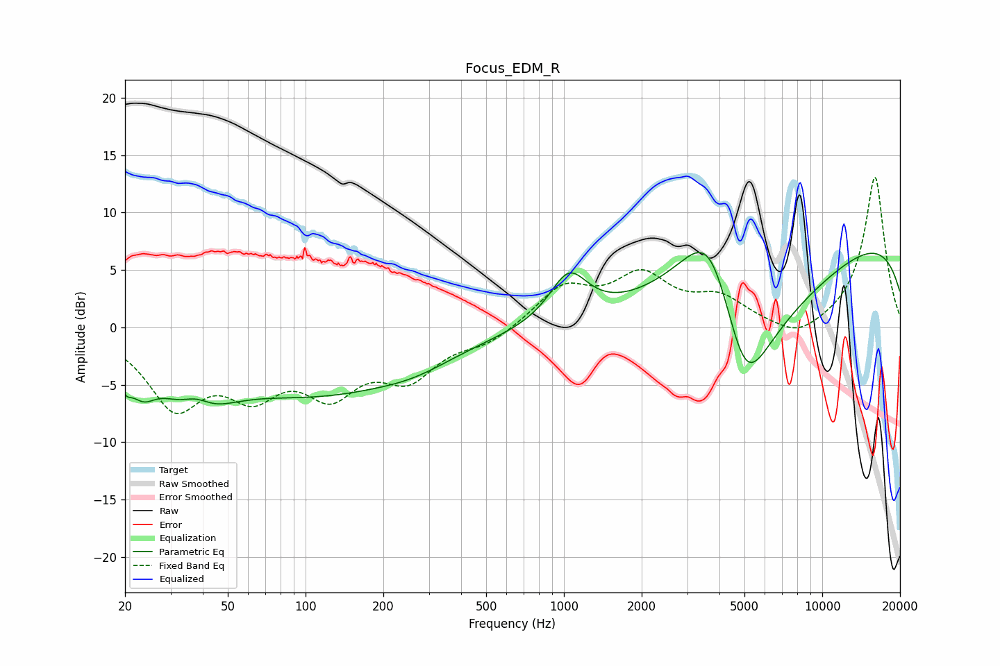

# Focus_EDM_R
See [usage instructions](https://github.com/jaakkopasanen/AutoEq#usage) for more options and info.

### Parametric EQs
Apply preamp of -6.6 dB when using parametric equalizer.

|   # | Type    |   Fc (Hz) |    Q |   Gain (dB) |
|-----|---------|-----------|------|-------------|
|   1 | Peaking |        20 | 5.76 |        -1.8 |
|   2 | Peaking |        23 | 2.75 |        -2.6 |
|   3 | Peaking |        37 | 1.24 |        -6.4 |
|   4 | Peaking |        37 | 2.08 |         3.3 |
|   5 | Peaking |       110 | 0.37 |        -5.4 |
|   6 | Peaking |       265 | 0.95 |        -0.9 |
|   7 | Peaking |      1044 | 1.92 |         4.2 |
|   8 | Peaking |      3710 | 0.96 |        13.2 |
|   9 | Peaking |      5005 | 0.77 |       -20   |
|  10 | Peaking |     10000 | 0.18 |         9.3 |

### Fixed Band EQs
When using fixed band (also called graphic) equalizer, apply preamp of **-13.2 dB** (if available) and set gains manually with these parameters.

|   # | Type    |   Fc (Hz) |    Q |   Gain (dB) |
|-----|---------|-----------|------|-------------|
|   1 | Peaking |        31 | 1.41 |        -6.4 |
|   2 | Peaking |        62 | 1.41 |        -4.6 |
|   3 | Peaking |       125 | 1.41 |        -4.9 |
|   4 | Peaking |       250 | 1.41 |        -3.9 |
|   5 | Peaking |       500 | 1.41 |        -1.2 |
|   6 | Peaking |      1000 | 1.41 |         3.3 |
|   7 | Peaking |      2000 | 1.41 |         4.1 |
|   8 | Peaking |      4000 | 1.41 |         2.2 |
|   9 | Peaking |      8000 | 1.41 |        -1.4 |
|  10 | Peaking |     16000 | 1.41 |        13.2 |

### Graphs

