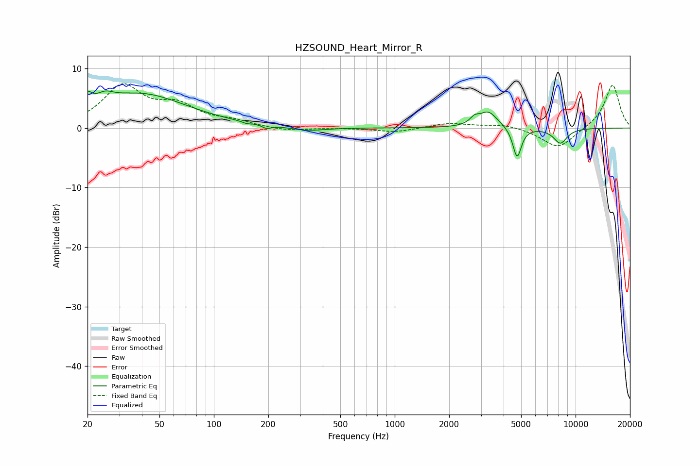

# HZSOUND_Heart_Mirror_R
See [usage instructions](https://github.com/jaakkopasanen/AutoEq#usage) for more options and info.

### Parametric EQs
Apply preamp of -6.3 dB when using parametric equalizer.

|   # | Type    |   Fc (Hz) |    Q |   Gain (dB) |
|-----|---------|-----------|------|-------------|
|   1 | Peaking |        20 | 5.79 |         2.1 |
|   2 | Peaking |        25 | 2.86 |         1.5 |
|   3 | Peaking |        39 | 0.55 |         5.6 |
|   4 | Peaking |       152 | 5.99 |        -0.3 |
|   5 | Peaking |       196 | 6    |        -0.6 |
|   6 | Peaking |       330 | 1.47 |        -0.6 |
|   7 | Peaking |      2759 | 5.97 |         1   |
|   8 | Peaking |      3288 | 2.68 |         2.8 |
|   9 | Peaking |      4751 | 6    |        -5.2 |
|  10 | Peaking |      8239 | 3.45 |        -2.5 |

### Fixed Band EQs
When using fixed band (also called graphic) equalizer, apply preamp of **-7.5 dB** (if available) and set gains manually with these parameters.

|   # | Type    |   Fc (Hz) |    Q |   Gain (dB) |
|-----|---------|-----------|------|-------------|
|   1 | Peaking |        31 | 1.41 |         6.8 |
|   2 | Peaking |        62 | 1.41 |         3.3 |
|   3 | Peaking |       125 | 1.41 |         1   |
|   4 | Peaking |       250 | 1.41 |        -0.5 |
|   5 | Peaking |       500 | 1.41 |        -0   |
|   6 | Peaking |      1000 | 1.41 |        -0.7 |
|   7 | Peaking |      2000 | 1.41 |         0.8 |
|   8 | Peaking |      4000 | 1.41 |         0.7 |
|   9 | Peaking |      8000 | 1.41 |        -3.5 |
|  10 | Peaking |     16000 | 1.41 |         7.4 |

### Graphs

