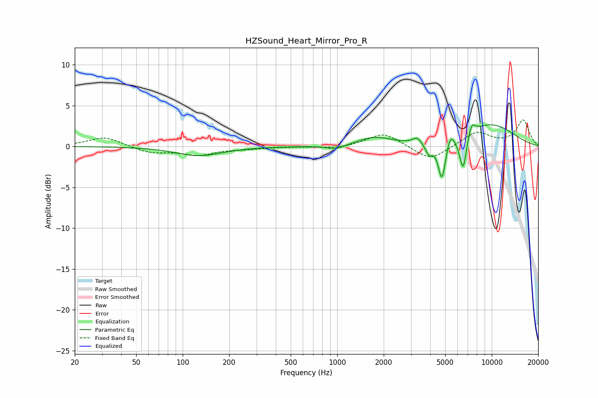

# HZSound_Heart_Mirror_Pro_R
See [usage instructions](https://github.com/jaakkopasanen/AutoEq#usage) for more options and info.

### Parametric EQs
Apply preamp of -2.7 dB when using parametric equalizer.

|   # | Type    |   Fc (Hz) |    Q |   Gain (dB) |
|-----|---------|-----------|------|-------------|
|   1 | Peaking |       128 | 0.94 |        -1.1 |
|   2 | Peaking |       986 | 2.32 |        -0.5 |
|   3 | Peaking |      1746 | 1.27 |         1.1 |
|   4 | Peaking |      3291 | 5.46 |         0.8 |
|   5 | Peaking |      3925 | 5.98 |        -1.3 |
|   6 | Peaking |      4765 | 5.88 |        -4.8 |
|   7 | Peaking |      5401 | 6    |         1.4 |
|   8 | Peaking |      6530 | 5.95 |        -4.4 |
|   9 | Peaking |      7419 | 6    |         1.5 |
|  10 | Peaking |      9804 | 0.7  |         2.7 |

### Fixed Band EQs
When using fixed band (also called graphic) equalizer, apply preamp of **-3.3 dB** (if available) and set gains manually with these parameters.

|   # | Type    |   Fc (Hz) |    Q |   Gain (dB) |
|-----|---------|-----------|------|-------------|
|   1 | Peaking |        31 | 1.41 |         1.2 |
|   2 | Peaking |        62 | 1.41 |        -0.8 |
|   3 | Peaking |       125 | 1.41 |        -1   |
|   4 | Peaking |       250 | 1.41 |        -0.2 |
|   5 | Peaking |       500 | 1.41 |        -0   |
|   6 | Peaking |      1000 | 1.41 |        -0.3 |
|   7 | Peaking |      2000 | 1.41 |         1.7 |
|   8 | Peaking |      4000 | 1.41 |        -1.8 |
|   9 | Peaking |      8000 | 1.41 |         1.8 |
|  10 | Peaking |     16000 | 1.41 |         3.2 |

### Graphs

