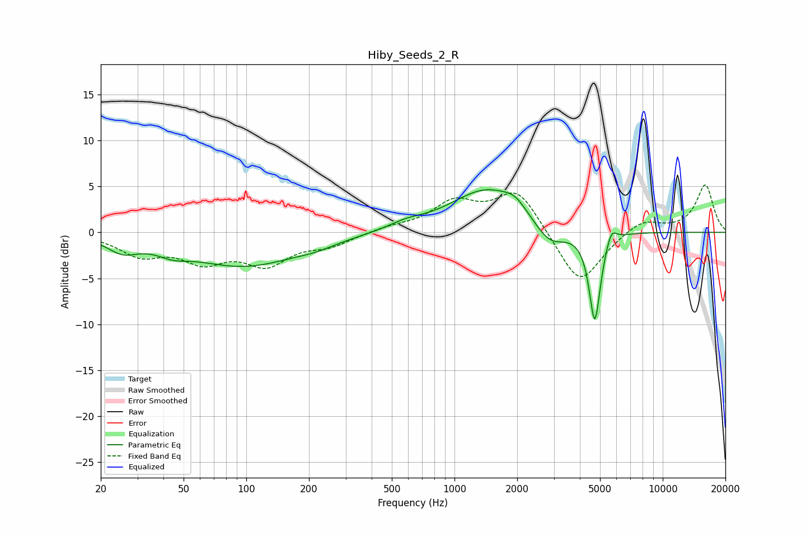

# Hiby_Seeds_2_R
See [usage instructions](https://github.com/jaakkopasanen/AutoEq#usage) for more options and info.

### Parametric EQs
Apply preamp of -4.7 dB when using parametric equalizer.

|   # | Type    |   Fc (Hz) |    Q |   Gain (dB) |
|-----|---------|-----------|------|-------------|
|   1 | Peaking |        25 | 1.96 |        -1.5 |
|   2 | Peaking |        44 | 1.98 |        -0.8 |
|   3 | Peaking |        97 | 0.52 |        -3.6 |
|   4 | Peaking |       217 | 1.63 |        -0.4 |
|   5 | Peaking |       583 | 1.65 |         0.6 |
|   6 | Peaking |      1439 | 0.8  |         4.7 |
|   7 | Peaking |      1956 | 2.74 |         1   |
|   8 | Peaking |      2863 | 1.84 |        -2.5 |
|   9 | Peaking |      4718 | 5.09 |        -9.9 |
|  10 | Peaking |      5668 | 5.8  |         1.6 |

### Fixed Band EQs
When using fixed band (also called graphic) equalizer, apply preamp of **-5.3 dB** (if available) and set gains manually with these parameters.

|   # | Type    |   Fc (Hz) |    Q |   Gain (dB) |
|-----|---------|-----------|------|-------------|
|   1 | Peaking |        31 | 1.41 |        -2.3 |
|   2 | Peaking |        62 | 1.41 |        -2.7 |
|   3 | Peaking |       125 | 1.41 |        -3.2 |
|   4 | Peaking |       250 | 1.41 |        -1.3 |
|   5 | Peaking |       500 | 1.41 |         0.5 |
|   6 | Peaking |      1000 | 1.41 |         3.1 |
|   7 | Peaking |      2000 | 1.41 |         4.6 |
|   8 | Peaking |      4000 | 1.41 |        -6   |
|   9 | Peaking |      8000 | 1.41 |         1.5 |
|  10 | Peaking |     16000 | 1.41 |         5.2 |

### Graphs

