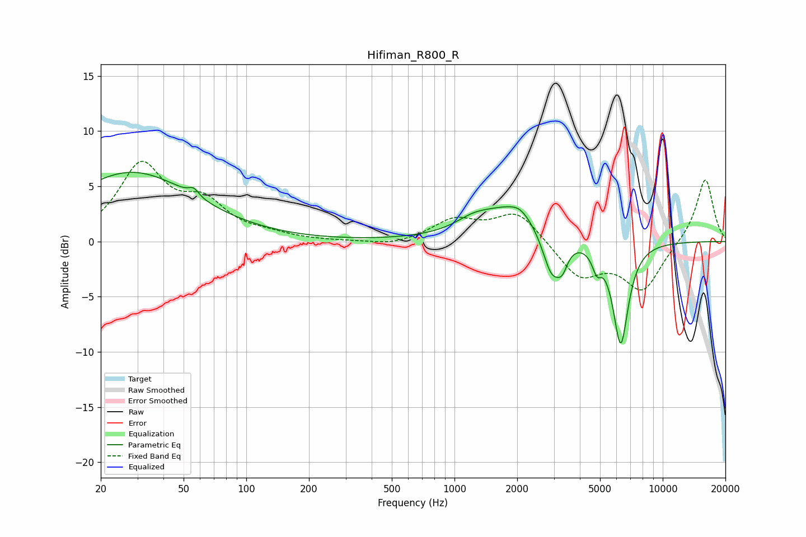

# Hifiman_R800_R
See [usage instructions](https://github.com/jaakkopasanen/AutoEq#usage) for more options and info.

### Parametric EQs
Apply preamp of -6.4 dB when using parametric equalizer.

|   # | Type    |   Fc (Hz) |    Q |   Gain (dB) |
|-----|---------|-----------|------|-------------|
|   1 | Peaking |        28 | 0.47 |         6.2 |
|   2 | Peaking |        56 | 5.96 |         0.7 |
|   3 | Peaking |      1230 | 1.72 |         0.8 |
|   4 | Peaking |      1946 | 0.89 |         3.2 |
|   5 | Peaking |      2055 | 3.4  |         0.4 |
|   6 | Peaking |      2941 | 2.91 |        -4.4 |
|   7 | Peaking |      3300 | 5.9  |        -1.4 |
|   8 | Peaking |      4870 | 5.91 |        -2.7 |
|   9 | Peaking |      4953 | 5.97 |         1.1 |
|  10 | Peaking |      6283 | 3.65 |        -9.3 |

### Fixed Band EQs
When using fixed band (also called graphic) equalizer, apply preamp of **-7.4 dB** (if available) and set gains manually with these parameters.

|   # | Type    |   Fc (Hz) |    Q |   Gain (dB) |
|-----|---------|-----------|------|-------------|
|   1 | Peaking |        31 | 1.41 |         6.7 |
|   2 | Peaking |        62 | 1.41 |         3   |
|   3 | Peaking |       125 | 1.41 |         0.5 |
|   4 | Peaking |       250 | 1.41 |        -0   |
|   5 | Peaking |       500 | 1.41 |        -0.4 |
|   6 | Peaking |      1000 | 1.41 |         1.9 |
|   7 | Peaking |      2000 | 1.41 |         2.7 |
|   8 | Peaking |      4000 | 1.41 |        -3.2 |
|   9 | Peaking |      8000 | 1.41 |        -4.3 |
|  10 | Peaking |     16000 | 1.41 |         5.8 |

### Graphs

