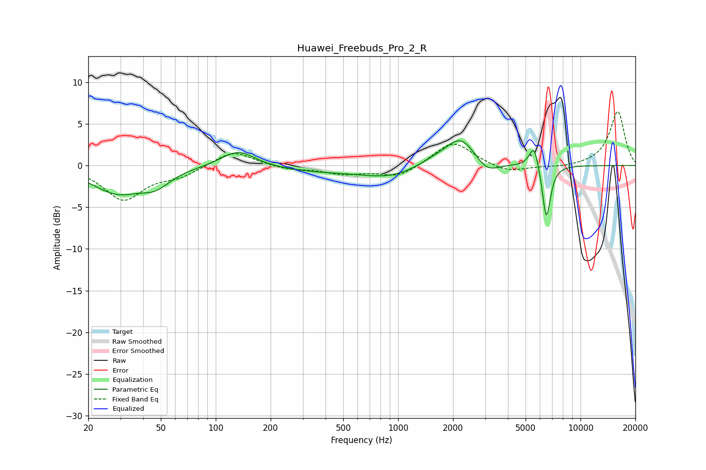

# Huawei_Freebuds_Pro_2_R
See [usage instructions](https://github.com/jaakkopasanen/AutoEq#usage) for more options and info.

### Parametric EQs
Apply preamp of -3.1 dB when using parametric equalizer.

|   # | Type    |   Fc (Hz) |    Q |   Gain (dB) |
|-----|---------|-----------|------|-------------|
|   1 | Peaking |        29 | 1.02 |        -3.1 |
|   2 | Peaking |        47 | 1.78 |        -1.6 |
|   3 | Peaking |       132 | 1.52 |         2   |
|   4 | Peaking |       347 | 0.64 |        -0.6 |
|   5 | Peaking |       911 | 0.85 |        -1.4 |
|   6 | Peaking |      1603 | 1.33 |         0.8 |
|   7 | Peaking |      2216 | 1.74 |         3.3 |
|   8 | Peaking |      3061 | 2.22 |        -1.5 |
|   9 | Peaking |      5568 | 5.21 |         3   |
|  10 | Peaking |      6501 | 6    |        -6.7 |

### Fixed Band EQs
When using fixed band (also called graphic) equalizer, apply preamp of **-6.6 dB** (if available) and set gains manually with these parameters.

|   # | Type    |   Fc (Hz) |    Q |   Gain (dB) |
|-----|---------|-----------|------|-------------|
|   1 | Peaking |        31 | 1.41 |        -4   |
|   2 | Peaking |        62 | 1.41 |        -1.1 |
|   3 | Peaking |       125 | 1.41 |         1.9 |
|   4 | Peaking |       250 | 1.41 |        -0.5 |
|   5 | Peaking |       500 | 1.41 |        -0.9 |
|   6 | Peaking |      1000 | 1.41 |        -1.4 |
|   7 | Peaking |      2000 | 1.41 |         3   |
|   8 | Peaking |      4000 | 1.41 |        -0.9 |
|   9 | Peaking |      8000 | 1.41 |        -0.3 |
|  10 | Peaking |     16000 | 1.41 |         6.5 |

### Graphs

