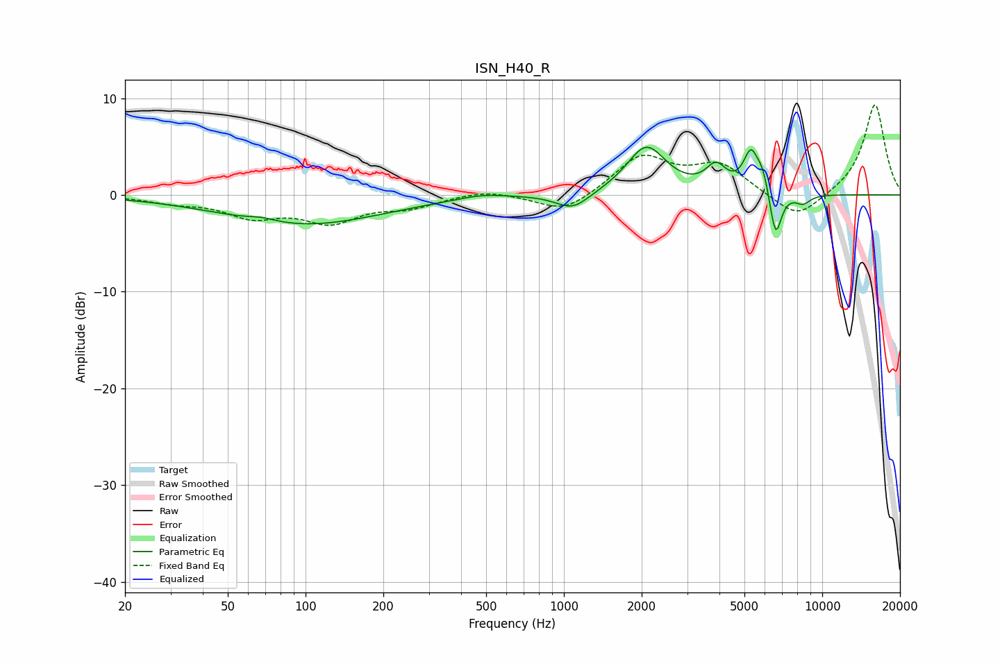

# ISN_H40_R
See [usage instructions](https://github.com/jaakkopasanen/AutoEq#usage) for more options and info.

### Parametric EQs
Apply preamp of -5.0 dB when using parametric equalizer.

|   # | Type    |   Fc (Hz) |    Q |   Gain (dB) |
|-----|---------|-----------|------|-------------|
|   1 | Peaking |        68 | 2.52 |         0.4 |
|   2 | Peaking |        98 | 0.46 |        -3.1 |
|   3 | Peaking |       483 | 1.51 |         0.5 |
|   4 | Peaking |      1082 | 2.17 |        -1.7 |
|   5 | Peaking |      2085 | 1.85 |         5   |
|   6 | Peaking |      3880 | 3.54 |         2.4 |
|   7 | Peaking |      5296 | 4.77 |         4   |
|   8 | Peaking |      5888 | 5.93 |         1.9 |
|   9 | Peaking |      6601 | 6    |        -4.9 |
|  10 | Peaking |      8418 | 4.39 |        -0.9 |

### Fixed Band EQs
When using fixed band (also called graphic) equalizer, apply preamp of **-9.4 dB** (if available) and set gains manually with these parameters.

|   # | Type    |   Fc (Hz) |    Q |   Gain (dB) |
|-----|---------|-----------|------|-------------|
|   1 | Peaking |        31 | 1.41 |        -0.6 |
|   2 | Peaking |        62 | 1.41 |        -2   |
|   3 | Peaking |       125 | 1.41 |        -2.6 |
|   4 | Peaking |       250 | 1.41 |        -1.1 |
|   5 | Peaking |       500 | 1.41 |         0.6 |
|   6 | Peaking |      1000 | 1.41 |        -2   |
|   7 | Peaking |      2000 | 1.41 |         3.9 |
|   8 | Peaking |      4000 | 1.41 |         3   |
|   9 | Peaking |      8000 | 1.41 |        -2.7 |
|  10 | Peaking |     16000 | 1.41 |         9.5 |

### Graphs

