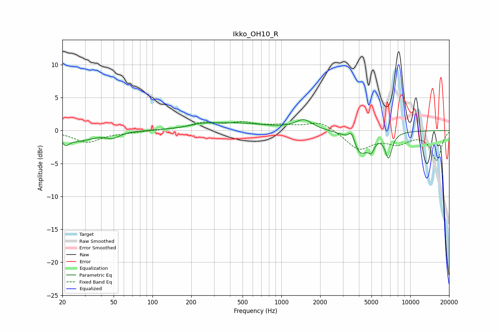

# Ikko_OH10_R
See [usage instructions](https://github.com/jaakkopasanen/AutoEq#usage) for more options and info.

### Parametric EQs
Apply preamp of -1.8 dB when using parametric equalizer.

|   # | Type    |   Fc (Hz) |    Q |   Gain (dB) |
|-----|---------|-----------|------|-------------|
|   1 | Peaking |        21 | 4.91 |        -1.2 |
|   2 | Peaking |        27 | 1.22 |        -1.4 |
|   3 | Peaking |        49 | 2.73 |        -0.8 |
|   4 | Peaking |       239 | 1.57 |         0.4 |
|   5 | Peaking |       444 | 0.58 |         1.1 |
|   6 | Peaking |      1496 | 2.19 |         1.5 |
|   7 | Peaking |      3505 | 5.99 |         1.7 |
|   8 | Peaking |      4100 | 2.22 |        -3.5 |
|   9 | Peaking |      4992 | 6    |        -1.5 |
|  10 | Peaking |      6781 | 5.04 |        -3.7 |

### Fixed Band EQs
When using fixed band (also called graphic) equalizer, apply preamp of **-1.5 dB** (if available) and set gains manually with these parameters.

|   # | Type    |   Fc (Hz) |    Q |   Gain (dB) |
|-----|---------|-----------|------|-------------|
|   1 | Peaking |        31 | 1.41 |        -1.8 |
|   2 | Peaking |        62 | 1.41 |        -0.2 |
|   3 | Peaking |       125 | 1.41 |         0.1 |
|   4 | Peaking |       250 | 1.41 |         1.1 |
|   5 | Peaking |       500 | 1.41 |         1   |
|   6 | Peaking |      1000 | 1.41 |         0.6 |
|   7 | Peaking |      2000 | 1.41 |         1.4 |
|   8 | Peaking |      4000 | 1.41 |        -2.8 |
|   9 | Peaking |      8000 | 1.41 |        -1.7 |
|  10 | Peaking |     16000 | 1.41 |        -4.4 |

### Graphs

