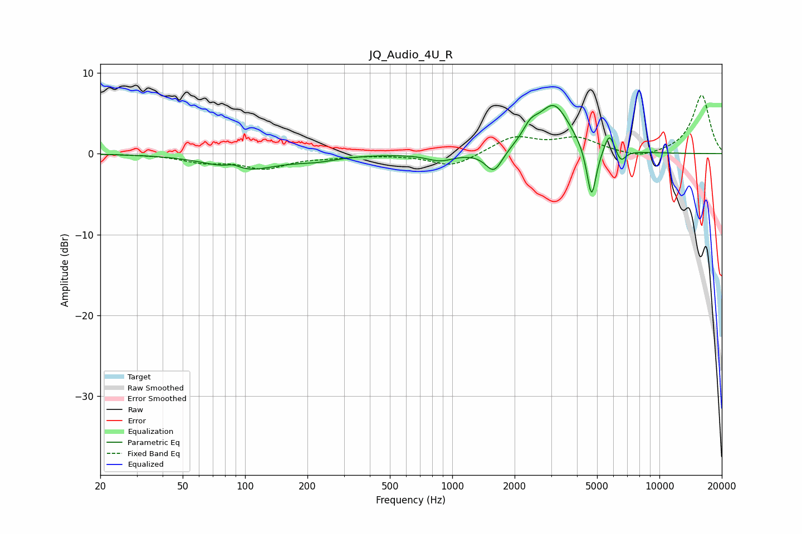

# JQ_Audio_4U_R
See [usage instructions](https://github.com/jaakkopasanen/AutoEq#usage) for more options and info.

### Parametric EQs
Apply preamp of -6.0 dB when using parametric equalizer.

|   # | Type    |   Fc (Hz) |    Q |   Gain (dB) |
|-----|---------|-----------|------|-------------|
|   1 | Peaking |        88 | 3.9  |         0.6 |
|   2 | Peaking |        98 | 0.93 |        -2   |
|   3 | Peaking |       221 | 1.36 |        -0.6 |
|   4 | Peaking |       875 | 2.19 |        -0.9 |
|   5 | Peaking |      1590 | 3.42 |        -2.7 |
|   6 | Peaking |      2383 | 3.71 |         1.7 |
|   7 | Peaking |      3097 | 1.79 |         5.9 |
|   8 | Peaking |      4701 | 5.98 |        -6.7 |
|   9 | Peaking |      5735 | 5.97 |         2.4 |
|  10 | Peaking |      6514 | 6    |        -1.5 |

### Fixed Band EQs
When using fixed band (also called graphic) equalizer, apply preamp of **-7.3 dB** (if available) and set gains manually with these parameters.

|   # | Type    |   Fc (Hz) |    Q |   Gain (dB) |
|-----|---------|-----------|------|-------------|
|   1 | Peaking |        31 | 1.41 |        -0   |
|   2 | Peaking |        62 | 1.41 |        -0.9 |
|   3 | Peaking |       125 | 1.41 |        -1.7 |
|   4 | Peaking |       250 | 1.41 |        -0.3 |
|   5 | Peaking |       500 | 1.41 |        -0.1 |
|   6 | Peaking |      1000 | 1.41 |        -1.7 |
|   7 | Peaking |      2000 | 1.41 |         2.1 |
|   8 | Peaking |      4000 | 1.41 |         1.8 |
|   9 | Peaking |      8000 | 1.41 |        -0.7 |
|  10 | Peaking |     16000 | 1.41 |         7.3 |

### Graphs

