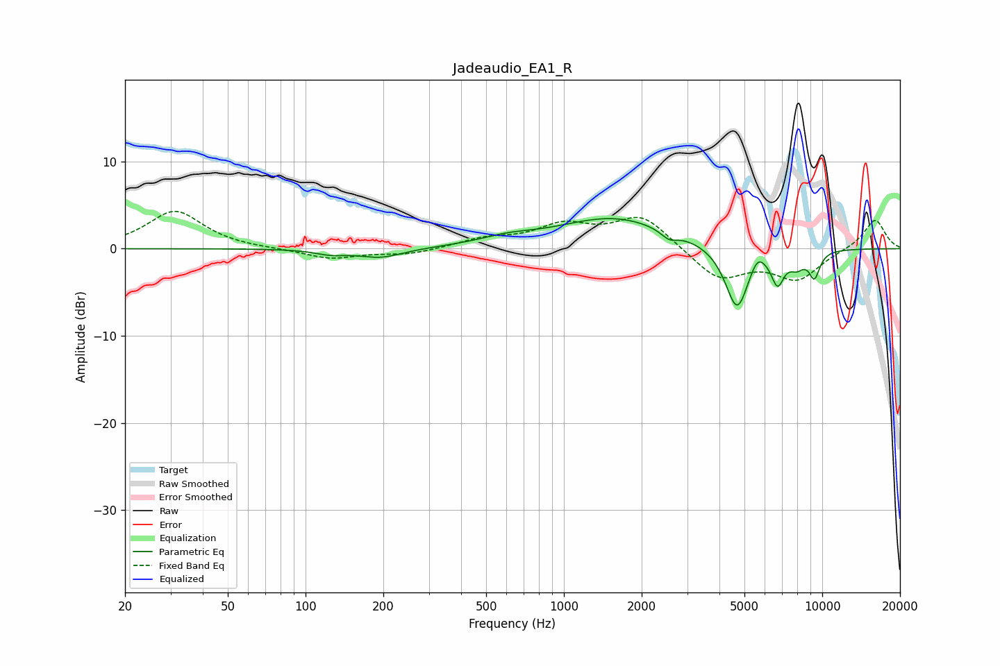

# Jadeaudio_EA1_R
See [usage instructions](https://github.com/jaakkopasanen/AutoEq#usage) for more options and info.

### Parametric EQs
Apply preamp of -3.5 dB when using parametric equalizer.

|   # | Type    |   Fc (Hz) |    Q |   Gain (dB) |
|-----|---------|-----------|------|-------------|
|   1 | Peaking |       125 | 2.41 |        -0.5 |
|   2 | Peaking |       195 | 1.61 |        -1.1 |
|   3 | Peaking |       602 | 1.31 |         0.7 |
|   4 | Peaking |      1567 | 0.64 |         3.5 |
|   5 | Peaking |      2555 | 4.49 |        -0.9 |
|   6 | Peaking |      4681 | 3.02 |        -7.4 |
|   7 | Peaking |      5610 | 4.92 |         1.6 |
|   8 | Peaking |      6718 | 5.45 |        -3.4 |
|   9 | Peaking |      7970 | 4.22 |        -1.5 |
|  10 | Peaking |      9328 | 5.91 |        -2.9 |

### Fixed Band EQs
When using fixed band (also called graphic) equalizer, apply preamp of **-4.4 dB** (if available) and set gains manually with these parameters.

|   # | Type    |   Fc (Hz) |    Q |   Gain (dB) |
|-----|---------|-----------|------|-------------|
|   1 | Peaking |        31 | 1.41 |         4.3 |
|   2 | Peaking |        62 | 1.41 |        -0   |
|   3 | Peaking |       125 | 1.41 |        -1.2 |
|   4 | Peaking |       250 | 1.41 |        -0.7 |
|   5 | Peaking |       500 | 1.41 |         1   |
|   6 | Peaking |      1000 | 1.41 |         2.4 |
|   7 | Peaking |      2000 | 1.41 |         3.7 |
|   8 | Peaking |      4000 | 1.41 |        -3.5 |
|   9 | Peaking |      8000 | 1.41 |        -3.4 |
|  10 | Peaking |     16000 | 1.41 |         3.4 |

### Graphs

