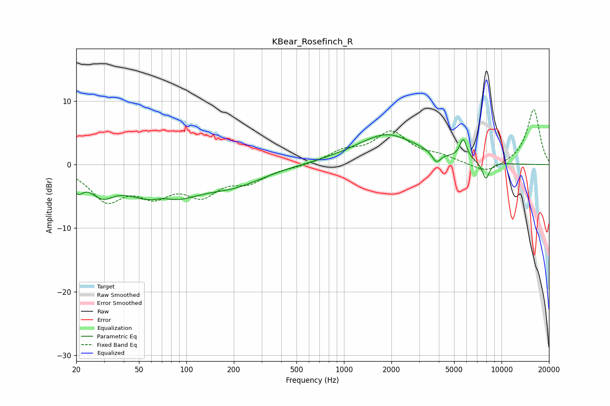

# KBear_Rosefinch_R
See [usage instructions](https://github.com/jaakkopasanen/AutoEq#usage) for more options and info.

### Parametric EQs
Apply preamp of -4.8 dB when using parametric equalizer.

|   # | Type    |   Fc (Hz) |    Q |   Gain (dB) |
|-----|---------|-----------|------|-------------|
|   1 | Peaking |        20 | 4.08 |        -2.5 |
|   2 | Peaking |        29 | 1.91 |        -3   |
|   3 | Peaking |        69 | 0.7  |        -6   |
|   4 | Peaking |        71 | 1.93 |         1.4 |
|   5 | Peaking |       204 | 0.73 |        -2.4 |
|   6 | Peaking |      1853 | 1.45 |         0.5 |
|   7 | Peaking |      1876 | 0.65 |         4.3 |
|   8 | Peaking |      3861 | 5.24 |        -1.7 |
|   9 | Peaking |      5712 | 6    |         3.1 |
|  10 | Peaking |      7942 | 5.69 |        -2.7 |

### Fixed Band EQs
When using fixed band (also called graphic) equalizer, apply preamp of **-8.8 dB** (if available) and set gains manually with these parameters.

|   # | Type    |   Fc (Hz) |    Q |   Gain (dB) |
|-----|---------|-----------|------|-------------|
|   1 | Peaking |        31 | 1.41 |        -5.2 |
|   2 | Peaking |        62 | 1.41 |        -3.9 |
|   3 | Peaking |       125 | 1.41 |        -4.1 |
|   4 | Peaking |       250 | 1.41 |        -2.3 |
|   5 | Peaking |       500 | 1.41 |        -0.3 |
|   6 | Peaking |      1000 | 1.41 |         1.8 |
|   7 | Peaking |      2000 | 1.41 |         4.8 |
|   8 | Peaking |      4000 | 1.41 |         1.1 |
|   9 | Peaking |      8000 | 1.41 |        -1.5 |
|  10 | Peaking |     16000 | 1.41 |         8.8 |

### Graphs

