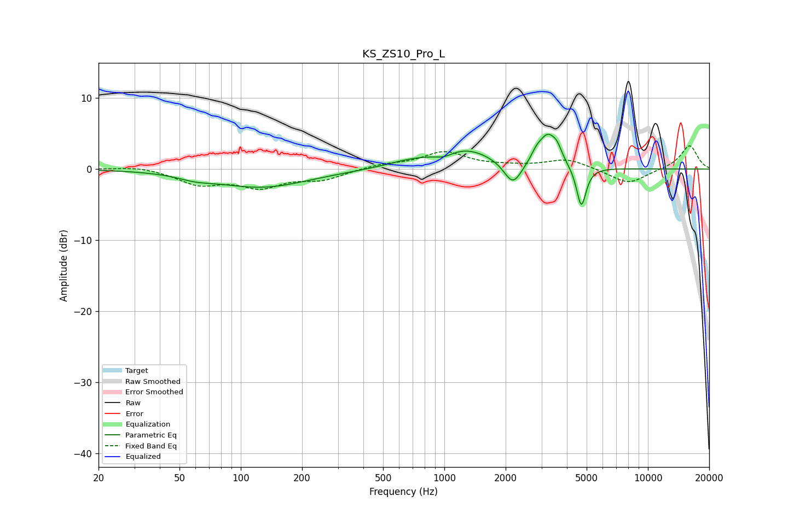

# KS_ZS10_Pro_L
See [usage instructions](https://github.com/jaakkopasanen/AutoEq#usage) for more options and info.

### Parametric EQs
Apply preamp of -5.0 dB when using parametric equalizer.

|   # | Type    |   Fc (Hz) |    Q |   Gain (dB) |
|-----|---------|-----------|------|-------------|
|   1 | Peaking |        60 | 1.72 |        -0.6 |
|   2 | Peaking |       127 | 0.62 |        -2.5 |
|   3 | Peaking |       679 | 1.17 |         0.8 |
|   4 | Peaking |       998 | 3.02 |        -0.7 |
|   5 | Peaking |      1265 | 1.01 |         2.7 |
|   6 | Peaking |      2171 | 3.27 |        -3.3 |
|   7 | Peaking |      2834 | 5.4  |         1.1 |
|   8 | Peaking |      3221 | 3.27 |         4.2 |
|   9 | Peaking |      3585 | 6    |         1.4 |
|  10 | Peaking |      4708 | 6    |        -5.8 |

### Fixed Band EQs
When using fixed band (also called graphic) equalizer, apply preamp of **-3.4 dB** (if available) and set gains manually with these parameters.

|   # | Type    |   Fc (Hz) |    Q |   Gain (dB) |
|-----|---------|-----------|------|-------------|
|   1 | Peaking |        31 | 1.41 |         0.4 |
|   2 | Peaking |        62 | 1.41 |        -2   |
|   3 | Peaking |       125 | 1.41 |        -2.3 |
|   4 | Peaking |       250 | 1.41 |        -1.3 |
|   5 | Peaking |       500 | 1.41 |         0.6 |
|   6 | Peaking |      1000 | 1.41 |         2.3 |
|   7 | Peaking |      2000 | 1.41 |         0.3 |
|   8 | Peaking |      4000 | 1.41 |         1.4 |
|   9 | Peaking |      8000 | 1.41 |        -2.2 |
|  10 | Peaking |     16000 | 1.41 |         3.4 |

### Graphs

