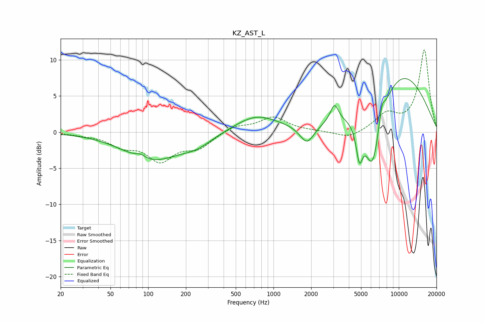

# KZ_AST_L
See [usage instructions](https://github.com/jaakkopasanen/AutoEq#usage) for more options and info.

### Parametric EQs
Apply preamp of -7.5 dB when using parametric equalizer.

|   # | Type    |   Fc (Hz) |    Q |   Gain (dB) |
|-----|---------|-----------|------|-------------|
|   1 | Peaking |        87 | 3.78 |         0.5 |
|   2 | Peaking |       107 | 0.63 |        -3.8 |
|   3 | Peaking |       244 | 1.16 |        -1.2 |
|   4 | Peaking |       728 | 0.82 |         2.3 |
|   5 | Peaking |      1851 | 2.47 |        -2.6 |
|   6 | Peaking |      3065 | 4.34 |         2.4 |
|   7 | Peaking |      4849 | 5.37 |        -4.6 |
|   8 | Peaking |      6174 | 2    |       -10.1 |
|   9 | Peaking |      7320 | 5.91 |         2.3 |
|  10 | Peaking |     10000 | 0.44 |         8.5 |

### Fixed Band EQs
When using fixed band (also called graphic) equalizer, apply preamp of **-11.5 dB** (if available) and set gains manually with these parameters.

|   # | Type    |   Fc (Hz) |    Q |   Gain (dB) |
|-----|---------|-----------|------|-------------|
|   1 | Peaking |        31 | 1.41 |        -0.2 |
|   2 | Peaking |        62 | 1.41 |        -1.7 |
|   3 | Peaking |       125 | 1.41 |        -3.6 |
|   4 | Peaking |       250 | 1.41 |        -2   |
|   5 | Peaking |       500 | 1.41 |         0.9 |
|   6 | Peaking |      1000 | 1.41 |         2   |
|   7 | Peaking |      2000 | 1.41 |         0.1 |
|   8 | Peaking |      4000 | 1.41 |        -1   |
|   9 | Peaking |      8000 | 1.41 |         2.3 |
|  10 | Peaking |     16000 | 1.41 |        11.3 |

### Graphs

