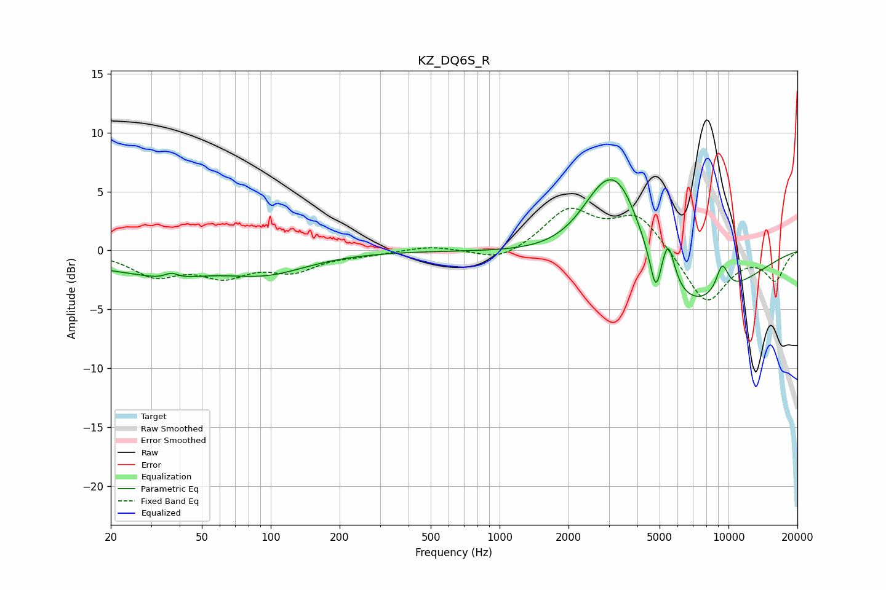

# KZ_DQ6S_R
See [usage instructions](https://github.com/jaakkopasanen/AutoEq#usage) for more options and info.

### Parametric EQs
Apply preamp of -6.1 dB when using parametric equalizer.

|   # | Type    |   Fc (Hz) |    Q |   Gain (dB) |
|-----|---------|-----------|------|-------------|
|   1 | Peaking |        27 | 0.4  |        -1.5 |
|   2 | Peaking |        36 | 1.3  |        -0.7 |
|   3 | Peaking |        37 | 4.71 |         0.5 |
|   4 | Peaking |        97 | 0.8  |        -1.5 |
|   5 | Peaking |      2791 | 1.39 |         2.9 |
|   6 | Peaking |      3390 | 1.08 |         8.5 |
|   7 | Peaking |      4814 | 6    |        -3.2 |
|   8 | Peaking |      5442 | 4.82 |         3.7 |
|   9 | Peaking |      5623 | 0.48 |        -7   |
|  10 | Peaking |      9389 | 4.52 |         2.5 |

### Fixed Band EQs
When using fixed band (also called graphic) equalizer, apply preamp of **-3.7 dB** (if available) and set gains manually with these parameters.

|   # | Type    |   Fc (Hz) |    Q |   Gain (dB) |
|-----|---------|-----------|------|-------------|
|   1 | Peaking |        31 | 1.41 |        -2   |
|   2 | Peaking |        62 | 1.41 |        -1.9 |
|   3 | Peaking |       125 | 1.41 |        -1.5 |
|   4 | Peaking |       250 | 1.41 |        -0.3 |
|   5 | Peaking |       500 | 1.41 |         0.4 |
|   6 | Peaking |      1000 | 1.41 |        -1   |
|   7 | Peaking |      2000 | 1.41 |         3.3 |
|   8 | Peaking |      4000 | 1.41 |         3   |
|   9 | Peaking |      8000 | 1.41 |        -4.6 |
|  10 | Peaking |     16000 | 1.41 |        -2.4 |

### Graphs

