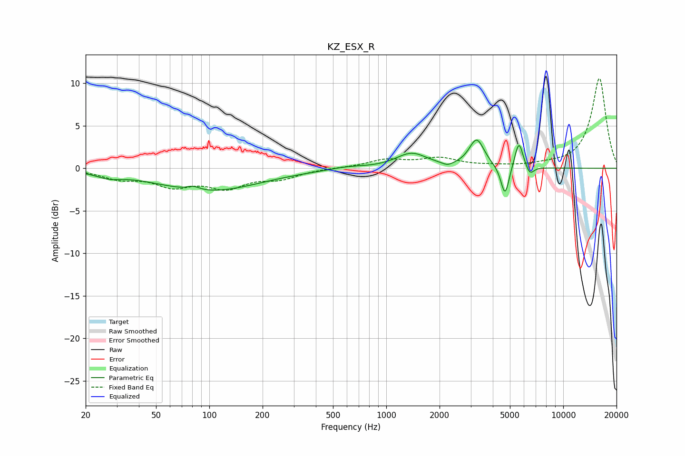

# KZ_ESX_R
See [usage instructions](https://github.com/jaakkopasanen/AutoEq#usage) for more options and info.

### Parametric EQs
Apply preamp of -3.4 dB when using parametric equalizer.

|   # | Type    |   Fc (Hz) |    Q |   Gain (dB) |
|-----|---------|-----------|------|-------------|
|   1 | Peaking |        27 | 2.09 |        -0.6 |
|   2 | Peaking |        81 | 4.09 |         0.4 |
|   3 | Peaking |        99 | 0.49 |        -2.6 |
|   4 | Peaking |       603 | 1.5  |         0.3 |
|   5 | Peaking |      1388 | 1.62 |         1.7 |
|   6 | Peaking |      2221 | 4.58 |        -0.4 |
|   7 | Peaking |      3243 | 3.32 |         3.3 |
|   8 | Peaking |      4690 | 6    |        -3.6 |
|   9 | Peaking |      5617 | 5.9  |         3.3 |
|  10 | Peaking |      6475 | 6    |        -1.1 |

### Fixed Band EQs
When using fixed band (also called graphic) equalizer, apply preamp of **-10.7 dB** (if available) and set gains manually with these parameters.

|   # | Type    |   Fc (Hz) |    Q |   Gain (dB) |
|-----|---------|-----------|------|-------------|
|   1 | Peaking |        31 | 1.41 |        -1.1 |
|   2 | Peaking |        62 | 1.41 |        -1.8 |
|   3 | Peaking |       125 | 1.41 |        -2   |
|   4 | Peaking |       250 | 1.41 |        -1.1 |
|   5 | Peaking |       500 | 1.41 |         0   |
|   6 | Peaking |      1000 | 1.41 |         0.9 |
|   7 | Peaking |      2000 | 1.41 |         1.1 |
|   8 | Peaking |      4000 | 1.41 |         0.2 |
|   9 | Peaking |      8000 | 1.41 |         0.3 |
|  10 | Peaking |     16000 | 1.41 |        10.6 |

### Graphs

