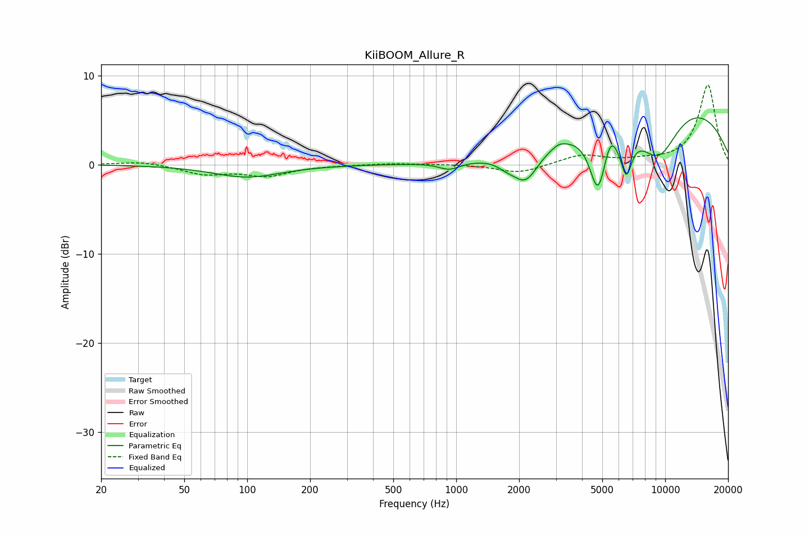

# KiiBOOM_Allure_R
See [usage instructions](https://github.com/jaakkopasanen/AutoEq#usage) for more options and info.

### Parametric EQs
Apply preamp of -5.3 dB when using parametric equalizer.

|   # | Type    |   Fc (Hz) |    Q |   Gain (dB) |
|-----|---------|-----------|------|-------------|
|   1 | Peaking |       100 | 0.87 |        -1.4 |
|   2 | Peaking |       927 | 2.79 |        -0.8 |
|   3 | Peaking |      1733 | 3.53 |        -0.6 |
|   4 | Peaking |      2146 | 2.25 |        -3.6 |
|   5 | Peaking |      3108 | 4.69 |         0.4 |
|   6 | Peaking |      4772 | 3.42 |        -7   |
|   7 | Peaking |      5448 | 4.83 |         1.8 |
|   8 | Peaking |      6507 | 4.85 |        -4.5 |
|   9 | Peaking |      9268 | 1.24 |        -6.2 |
|  10 | Peaking |      9884 | 0.28 |         7.7 |

### Fixed Band EQs
When using fixed band (also called graphic) equalizer, apply preamp of **-9.0 dB** (if available) and set gains manually with these parameters.

|   # | Type    |   Fc (Hz) |    Q |   Gain (dB) |
|-----|---------|-----------|------|-------------|
|   1 | Peaking |        31 | 1.41 |         0.4 |
|   2 | Peaking |        62 | 1.41 |        -1   |
|   3 | Peaking |       125 | 1.41 |        -1.2 |
|   4 | Peaking |       250 | 1.41 |        -0   |
|   5 | Peaking |       500 | 1.41 |         0.2 |
|   6 | Peaking |      1000 | 1.41 |         0   |
|   7 | Peaking |      2000 | 1.41 |        -1   |
|   8 | Peaking |      4000 | 1.41 |         1.1 |
|   9 | Peaking |      8000 | 1.41 |         0.3 |
|  10 | Peaking |     16000 | 1.41 |         8.9 |

### Graphs

