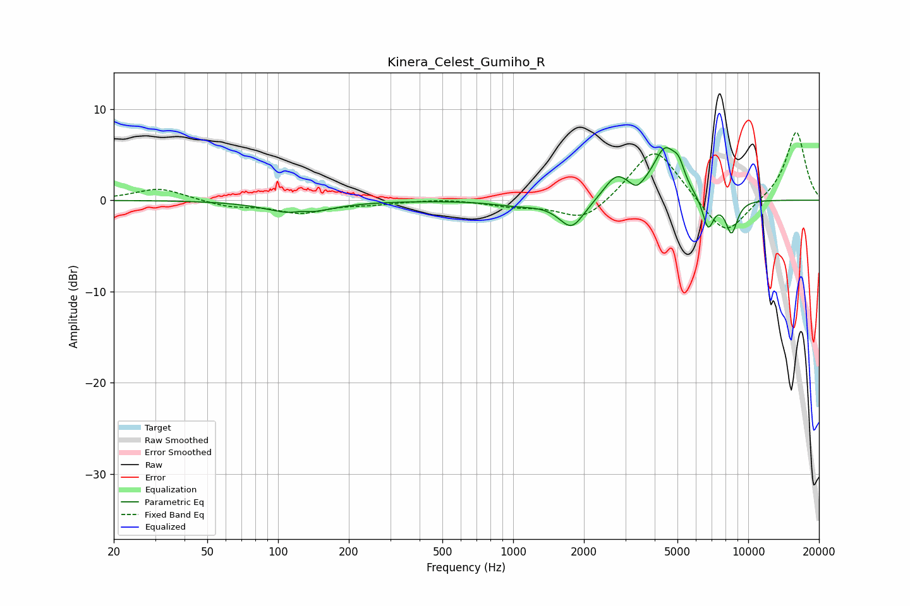

# Kinera_Celest_Gumiho_R
See [usage instructions](https://github.com/jaakkopasanen/AutoEq#usage) for more options and info.

### Parametric EQs
Apply preamp of -5.8 dB when using parametric equalizer.

|   # | Type    |   Fc (Hz) |    Q |   Gain (dB) |
|-----|---------|-----------|------|-------------|
|   1 | Peaking |       122 | 1.17 |        -1.5 |
|   2 | Peaking |       125 | 4.46 |         0.3 |
|   3 | Peaking |      1041 | 1.39 |        -0.5 |
|   4 | Peaking |      1774 | 2.61 |        -3.1 |
|   5 | Peaking |      2749 | 2.71 |         2.6 |
|   6 | Peaking |      3355 | 5.53 |        -0.8 |
|   7 | Peaking |      4427 | 2.7  |         5.3 |
|   8 | Peaking |      5066 | 5.65 |         1.8 |
|   9 | Peaking |      6752 | 5.76 |        -3.4 |
|  10 | Peaking |      8489 | 5.15 |        -3.6 |

### Fixed Band EQs
When using fixed band (also called graphic) equalizer, apply preamp of **-7.5 dB** (if available) and set gains manually with these parameters.

|   # | Type    |   Fc (Hz) |    Q |   Gain (dB) |
|-----|---------|-----------|------|-------------|
|   1 | Peaking |        31 | 1.41 |         1.3 |
|   2 | Peaking |        62 | 1.41 |        -0.7 |
|   3 | Peaking |       125 | 1.41 |        -1.3 |
|   4 | Peaking |       250 | 1.41 |        -0.3 |
|   5 | Peaking |       500 | 1.41 |         0.2 |
|   6 | Peaking |      1000 | 1.41 |        -0.6 |
|   7 | Peaking |      2000 | 1.41 |        -2.4 |
|   8 | Peaking |      4000 | 1.41 |         6.1 |
|   9 | Peaking |      8000 | 1.41 |        -4.3 |
|  10 | Peaking |     16000 | 1.41 |         7.6 |

### Graphs

