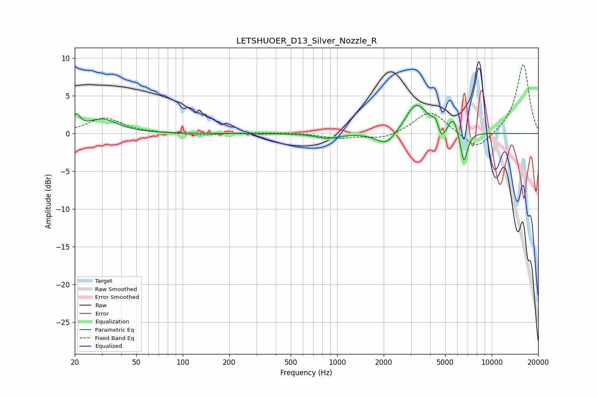

# LETSHUOER_D13_Silver_Nozzle_R
See [usage instructions](https://github.com/jaakkopasanen/AutoEq#usage) for more options and info.

### Parametric EQs
Apply preamp of -3.8 dB when using parametric equalizer.

|   # | Type    |   Fc (Hz) |    Q |   Gain (dB) |
|-----|---------|-----------|------|-------------|
|   1 | Peaking |        20 | 5.84 |         1.8 |
|   2 | Peaking |        30 | 1.47 |         1.8 |
|   3 | Peaking |       860 | 1.94 |        -0.6 |
|   4 | Peaking |      2077 | 2.25 |        -1.9 |
|   5 | Peaking |      3107 | 3.31 |         0.4 |
|   6 | Peaking |      3283 | 1.96 |         3.8 |
|   7 | Peaking |      4339 | 6    |         1.1 |
|   8 | Peaking |      4731 | 6    |        -1.8 |
|   9 | Peaking |      5645 | 5.22 |         2   |
|  10 | Peaking |      6622 | 6    |        -4.2 |

### Fixed Band EQs
When using fixed band (also called graphic) equalizer, apply preamp of **-9.2 dB** (if available) and set gains manually with these parameters.

|   # | Type    |   Fc (Hz) |    Q |   Gain (dB) |
|-----|---------|-----------|------|-------------|
|   1 | Peaking |        31 | 1.41 |         2.1 |
|   2 | Peaking |        62 | 1.41 |         0   |
|   3 | Peaking |       125 | 1.41 |        -0.3 |
|   4 | Peaking |       250 | 1.41 |         0.1 |
|   5 | Peaking |       500 | 1.41 |         0.1 |
|   6 | Peaking |      1000 | 1.41 |        -0.6 |
|   7 | Peaking |      2000 | 1.41 |        -0.8 |
|   8 | Peaking |      4000 | 1.41 |         3.1 |
|   9 | Peaking |      8000 | 1.41 |        -2.4 |
|  10 | Peaking |     16000 | 1.41 |         9.3 |

### Graphs

