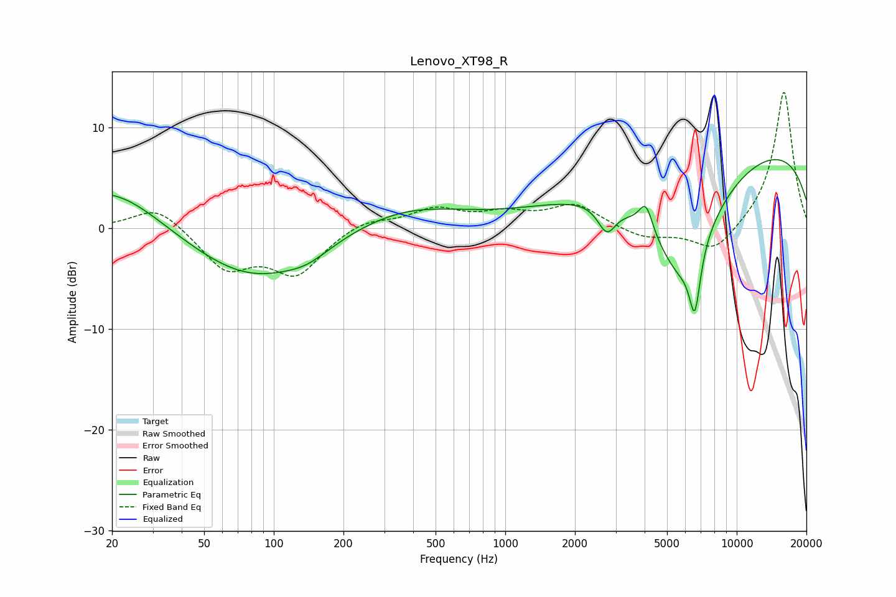

# Lenovo_XT98_R
See [usage instructions](https://github.com/jaakkopasanen/AutoEq#usage) for more options and info.

### Parametric EQs
Apply preamp of -6.9 dB when using parametric equalizer.

|   # | Type    |   Fc (Hz) |    Q |   Gain (dB) |
|-----|---------|-----------|------|-------------|
|   1 | Peaking |        20 | 0.64 |         4.8 |
|   2 | Peaking |        42 | 0.37 |        -0.9 |
|   3 | Peaking |        84 | 0.54 |        -4.6 |
|   4 | Peaking |       140 | 1.6  |        -0.8 |
|   5 | Peaking |       369 | 0.57 |         2.2 |
|   6 | Peaking |      2746 | 3.63 |        -2.7 |
|   7 | Peaking |      4054 | 4.76 |         2.8 |
|   8 | Peaking |      5759 | 0.92 |       -11.9 |
|   9 | Peaking |      6592 | 5.67 |        -6   |
|  10 | Peaking |      9557 | 0.18 |         8.9 |

### Fixed Band EQs
When using fixed band (also called graphic) equalizer, apply preamp of **-13.6 dB** (if available) and set gains manually with these parameters.

|   # | Type    |   Fc (Hz) |    Q |   Gain (dB) |
|-----|---------|-----------|------|-------------|
|   1 | Peaking |        31 | 1.41 |         2.4 |
|   2 | Peaking |        62 | 1.41 |        -3.9 |
|   3 | Peaking |       125 | 1.41 |        -4.3 |
|   4 | Peaking |       250 | 1.41 |         1   |
|   5 | Peaking |       500 | 1.41 |         1.8 |
|   6 | Peaking |      1000 | 1.41 |         1.3 |
|   7 | Peaking |      2000 | 1.41 |         2.3 |
|   8 | Peaking |      4000 | 1.41 |        -1   |
|   9 | Peaking |      8000 | 1.41 |        -2.6 |
|  10 | Peaking |     16000 | 1.41 |        13.7 |

### Graphs

