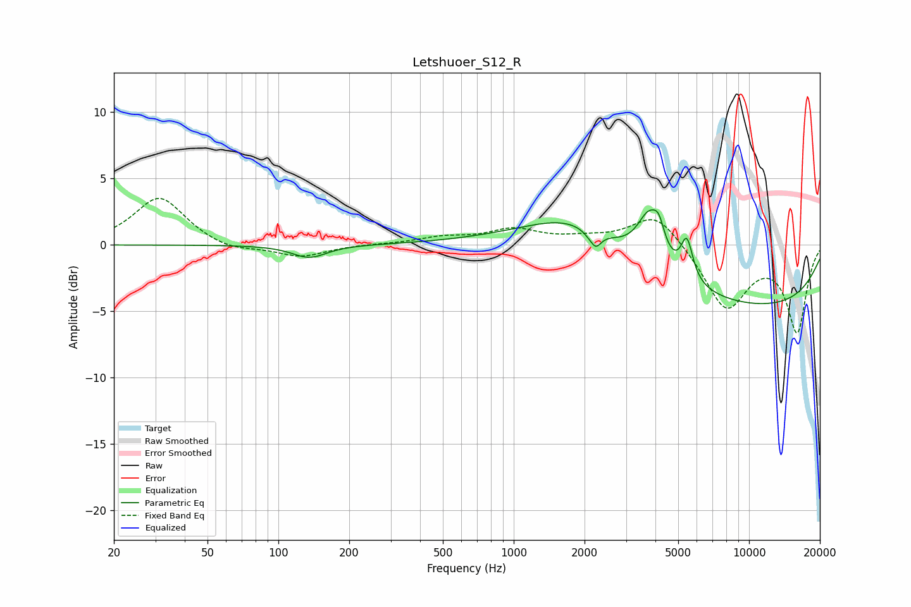

# Letshuoer_S12_R
See [usage instructions](https://github.com/jaakkopasanen/AutoEq#usage) for more options and info.

### Parametric EQs
Apply preamp of -2.7 dB when using parametric equalizer.

|   # | Type    |   Fc (Hz) |    Q |   Gain (dB) |
|-----|---------|-----------|------|-------------|
|   1 | Peaking |       124 | 2.26 |         0   |
|   2 | Peaking |       135 | 1.94 |        -1   |
|   3 | Peaking |      1664 | 1.03 |         0.7 |
|   4 | Peaking |      2017 | 0.49 |         2.3 |
|   5 | Peaking |      2058 | 5.94 |        -0.2 |
|   6 | Peaking |      2230 | 5.98 |        -1.1 |
|   7 | Peaking |      3755 | 2.81 |         3.4 |
|   8 | Peaking |      4139 | 5.78 |         1.6 |
|   9 | Peaking |      5442 | 5.53 |         3   |
|  10 | Peaking |      9682 | 0.23 |        -4.7 |

### Fixed Band EQs
When using fixed band (also called graphic) equalizer, apply preamp of **-3.6 dB** (if available) and set gains manually with these parameters.

|   # | Type    |   Fc (Hz) |    Q |   Gain (dB) |
|-----|---------|-----------|------|-------------|
|   1 | Peaking |        31 | 1.41 |         3.6 |
|   2 | Peaking |        62 | 1.41 |        -0.5 |
|   3 | Peaking |       125 | 1.41 |        -0.9 |
|   4 | Peaking |       250 | 1.41 |         0   |
|   5 | Peaking |       500 | 1.41 |         0.5 |
|   6 | Peaking |      1000 | 1.41 |         1.1 |
|   7 | Peaking |      2000 | 1.41 |         0.4 |
|   8 | Peaking |      4000 | 1.41 |         2.5 |
|   9 | Peaking |      8000 | 1.41 |        -4.8 |
|  10 | Peaking |     16000 | 1.41 |        -6.4 |

### Graphs

