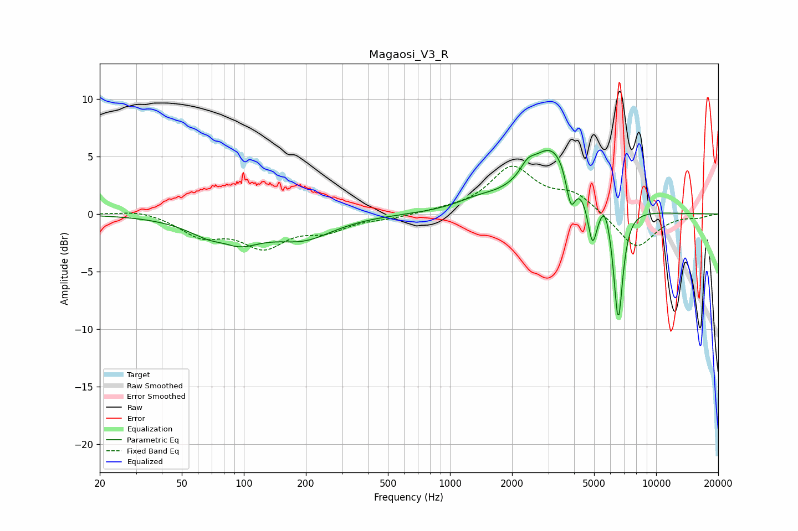

# Magaosi_V3_R
See [usage instructions](https://github.com/jaakkopasanen/AutoEq#usage) for more options and info.

### Parametric EQs
Apply preamp of -5.6 dB when using parametric equalizer.

|   # | Type    |   Fc (Hz) |    Q |   Gain (dB) |
|-----|---------|-----------|------|-------------|
|   1 | Peaking |        81 | 2.07 |         1.2 |
|   2 | Peaking |        83 | 1.13 |        -3.4 |
|   3 | Peaking |       196 | 0.97 |        -1.8 |
|   4 | Peaking |      1367 | 1.36 |         0.7 |
|   5 | Peaking |      2374 | 4.11 |         0.9 |
|   6 | Peaking |      3165 | 1.18 |         5.8 |
|   7 | Peaking |      3854 | 5.99 |        -3.3 |
|   8 | Peaking |      4911 | 6    |        -4.2 |
|   9 | Peaking |      5663 | 5.91 |         1.2 |
|  10 | Peaking |      6548 | 6    |       -10.1 |

### Fixed Band EQs
When using fixed band (also called graphic) equalizer, apply preamp of **-4.3 dB** (if available) and set gains manually with these parameters.

|   # | Type    |   Fc (Hz) |    Q |   Gain (dB) |
|-----|---------|-----------|------|-------------|
|   1 | Peaking |        31 | 1.41 |         0.4 |
|   2 | Peaking |        62 | 1.41 |        -1.7 |
|   3 | Peaking |       125 | 1.41 |        -2.6 |
|   4 | Peaking |       250 | 1.41 |        -1.2 |
|   5 | Peaking |       500 | 1.41 |        -0.3 |
|   6 | Peaking |      1000 | 1.41 |         0.2 |
|   7 | Peaking |      2000 | 1.41 |         3.9 |
|   8 | Peaking |      4000 | 1.41 |         1.6 |
|   9 | Peaking |      8000 | 1.41 |        -3.1 |
|  10 | Peaking |     16000 | 1.41 |        -0.3 |

### Graphs

