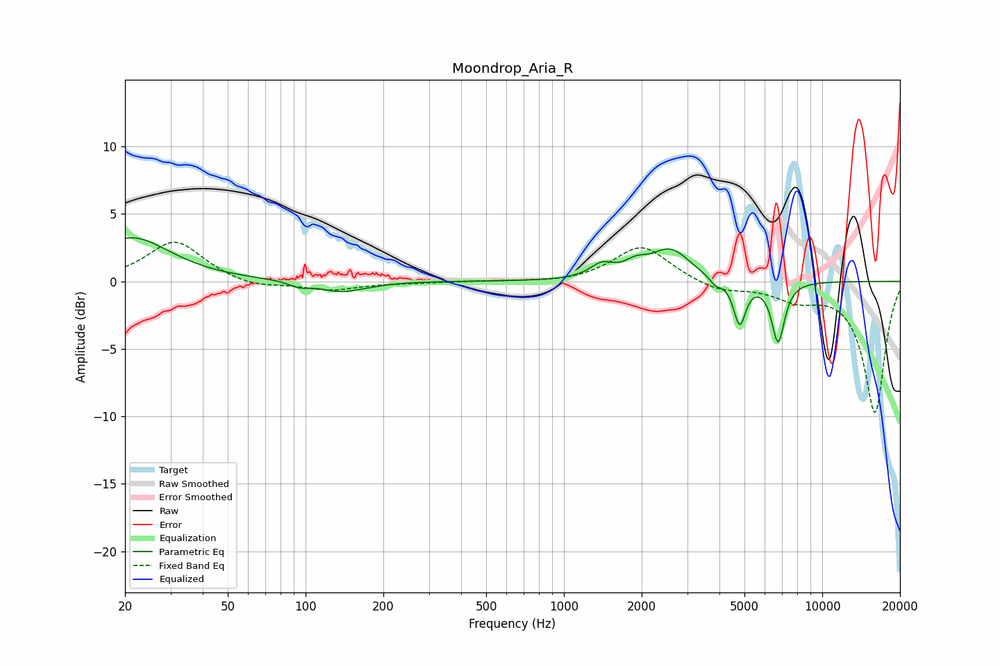

# Moondrop_Aria_R
See [usage instructions](https://github.com/jaakkopasanen/AutoEq#usage) for more options and info.

### Parametric EQs
Apply preamp of -3.3 dB when using parametric equalizer.

|   # | Type    |   Fc (Hz) |    Q |   Gain (dB) |
|-----|---------|-----------|------|-------------|
|   1 | Peaking |        21 | 0.96 |         3.2 |
|   2 | Peaking |        95 | 3.62 |        -0.4 |
|   3 | Peaking |       136 | 1.78 |        -0.7 |
|   4 | Peaking |       177 | 2.04 |        -0.1 |
|   5 | Peaking |      1402 | 3.14 |         1   |
|   6 | Peaking |      1895 | 3.25 |         0.8 |
|   7 | Peaking |      2582 | 1.84 |         2.3 |
|   8 | Peaking |      3860 | 5.97 |        -0.6 |
|   9 | Peaking |      4791 | 5.93 |        -3.2 |
|  10 | Peaking |      6750 | 5.44 |        -4.5 |

### Fixed Band EQs
When using fixed band (also called graphic) equalizer, apply preamp of **-3.0 dB** (if available) and set gains manually with these parameters.

|   # | Type    |   Fc (Hz) |    Q |   Gain (dB) |
|-----|---------|-----------|------|-------------|
|   1 | Peaking |        31 | 1.41 |         3   |
|   2 | Peaking |        62 | 1.41 |        -0.5 |
|   3 | Peaking |       125 | 1.41 |        -0.6 |
|   4 | Peaking |       250 | 1.41 |        -0.1 |
|   5 | Peaking |       500 | 1.41 |         0   |
|   6 | Peaking |      1000 | 1.41 |        -0.1 |
|   7 | Peaking |      2000 | 1.41 |         2.7 |
|   8 | Peaking |      4000 | 1.41 |        -0.7 |
|   9 | Peaking |      8000 | 1.41 |        -1.1 |
|  10 | Peaking |     16000 | 1.41 |        -9.7 |

### Graphs

